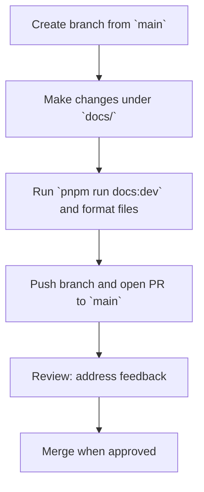

## Overview

This document explains how to contribute to the documentation site located in the `docs/` directory of this repository. Use this guide when you're improving guides, reference pages, examples, or site configuration. This guide is docs-site-specific; for repository-wide contribution rules (code, licensing, and governance), see the repository-level guide at https://github.com/doctypedev/sintesi/blob/main/CONTRIBUTING.md.

To work locally, clone the repository:

```bash
git clone https://github.com/doctypedev/sintesi
cd sintesi
```

Setup: install dependencies

```bash
# Recommended (if this repo uses pnpm)
pnpm install

# Or with npm
npm install

# Or with yarn
yarn install
```

Run the docs development server (hot reload):

```bash
# If using pnpm (recommended)
pnpm run docs:dev

# Or with npm
npm run docs:dev

# Or with yarn
yarn run docs:dev
```

Build and preview a production site:

```bash
# pnpm
pnpm run docs:preview

# npm
npm run docs:preview

# yarn
yarn run docs:preview
```

## Branch & PR Process

Follow a simple branch and pull request process for docs changes. Keep PRs focused and scoped to a single topic (typo fix, new guide, API doc update, etc.).



- Create a branch from `main`. Branch names should make the purpose clear, for example: `docs/fix-typo-setup` or `docs/add-ci-guide`.
- Open a Pull Request (PR) targeting the `main` branch in the repository: https://github.com/doctypedev/sintesi.
- Use clear titles and descriptions. If the change requires discussion, open an issue first and link it from the PR.
- Address review comments promptly and keep commits tidy. Squash or rebase as appropriate before merge.

> **Note:** If your change touches generated files or a large surface area, prefer a smaller, iterative PR rather than a single huge one — it helps reviewers and speeds merge time.

## Where to Open Issues

Open issues and PRs in the main repository:

- Issues: https://github.com/doctypedev/sintesi/issues
- Pull Requests: https://github.com/doctypedev/sintesi/pulls

Use issues to request new docs, report inaccuracies, or discuss larger structural changes to the docs site.

## Docs Editing Guidelines

Edit files under the `docs/` directory. Keep content clear, actionable, and accurate. Use the existing site structure (guides, reference, scripts) when adding new pages.

- Use `README.md` or `index.md` for section landing pages.
- Keep pages concise and focused on a single concept.
- Include working examples and code snippets where helpful (use fenced code blocks).
- Preserve existing frontmatter fields when updating pages.

Always run the dev server to preview changes locally.

## Style & Formatting Rules

This repository enforces formatting and linting at the root. Follow these rules for docs files:

- Use Prettier settings from the root `.prettierrc`.
- Use the root ESLint configuration for any JS/TS files in `docs/` if applicable.

A few explicit rules for Markdown pages:

- Always include YAML frontmatter for top-level pages when required by the site. Use strings for textual fields and unquoted numbers for numeric fields. Example:

```yaml
---
title: 'My Page Title'
description: 'Short description'
icon: '📘'
order: 40
---
```

- Use `H2` (`##`) and `H3` (`###`) to structure pages. Avoid deeper heading levels unless necessary.
- Use backticks for paths and inline identifiers: `docs/`, `pnpm run docs:dev`, `--no-strict`.
- Use **bold** to emphasize key concepts.
- For any process or flow use Mermaid diagrams. Quote labels inside nodes (e.g., `id["Label"]`) to avoid syntax issues.
- Run Prettier on updated files before committing:

```bash
npx prettier --write "docs/**/*.md"
```

(If you prefer your package manager's tooling, use the equivalent command provided by pnpm, npm, or yarn.)

- When adding CLI examples, only show flags and commands that exist in the repository (do not invent flags). Use the documented flags like `--no-strict` where relevant.

Note: This guide focuses on docs-site-specific style and tooling. For repository-level contribution rules (license, code of conduct, CI policies), refer to the repository-level CONTRIBUTING.md: https://github.com/doctypedev/sintesi/blob/main/CONTRIBUTING.md.

## Accessibility & Content Quality

Write with clarity and accessibility in mind. Use short paragraphs, descriptive link text, and meaningful alt text for images. Prefer examples that a reader can copy and run.

## Commit & PR Checklist

Before opening a PR, ensure the following:

- You branched from `main`.
- Changes are limited to the intended scope (docs files under `docs/` or related site config).
- Local preview succeeds using your package manager's equivalent (for example, `pnpm run docs:dev` or `npm run docs:dev`).
- Markdown is formatted with Prettier: `npx prettier --write "docs/**/*.md"`.
- Any code samples are tested or verified where feasible.
- The PR description explains the why and what; links to related issues if any.

## Review & Merge

Docs PRs are reviewed by maintainers and other contributors. Be responsive to feedback and update the PR accordingly. Once approved, a maintainer will merge the PR into `main`.

## Linking Back to Repository-Level Contributing Guide

For contributions that affect code, licensing, or project governance, or for information about the project's overall contribution process, see the repository-level guide at:

https://github.com/doctypedev/sintesi/blob/main/CONTRIBUTING.md

This docs-level guide is complementary: it focuses only on the `docs/` site and authoring best practices.

## Contact & Support

If you have questions that are not covered here, open an issue in the repository: https://github.com/doctypedev/sintesi/issues. Maintainers monitor that queue and will point you to the right place.

Thank you for helping improve the documentation — well-written docs help everyone.
