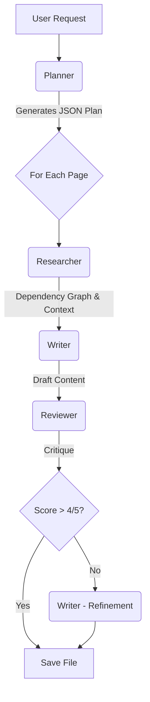

# AI Architecture: Model Routing (Planner/Writer)

The Sintesi CLI implements a "Model Routing" architecture to optimize the balance between cost, quality, and speed when interacting with AI models. This approach assigns specific AI models (with varying capabilities and costs) to distinct roles:

1.  **Planner (Architect)**: Reasoning and strategy.
2.  **Researcher (The Scout)**: Exploring dependency graphs and gathering context.
3.  **Writer (Builder)**: Efficient content generation.
4.  **Reviewer (Critique)**: Validating output against strict rules.

## Default Models (Configurable via Environment Variables)

The CLI automatically selects appropriate models based on the detected API key provider:

*   **OpenAI API Key (`OPENAI_API_KEY`)**:
    *   **Planner**: `o4-mini` (Reasoning).
    *   **Writer**: `gpt-4o-mini` (Fast generation).
    *   **Researcher**: `o4-mini` (Fast context gathering).
    *   **Reviewer**: `gpt-4o` (Critical analysis).
*   **Gemini API Key (`GEMINI_API_KEY`)**:
    *   **Planner**: `gemini-1.5-flash`
    *   **Writer**: `gemini-1.5-flash-001`
    *   **Researcher**: `gemini-1.5-flash-001`
    *   **Reviewer**: `gemini-1.5-pro`
*   **Anthropic API Key (`ANTHROPIC_API_KEY`)**:
    *   **Planner**: `claude-3-5-haiku-20241022`
    *   **Writer**: `claude-3-5-haiku-20241022`
    *   **Researcher**: `claude-3-5-haiku-20241022`
    *   **Reviewer**: `claude-3-5-sonnet-20241022`
*   **Mistral API Key (`MISTRAL_API_KEY`)**:
    *   **Planner**: `mistral-large-latest`
    *   **Writer**: `mistral-small-latest`
    *   **Researcher**: `mistral-small-latest`
    *   **Reviewer**: `mistral-large-latest`

You can override these defaults by setting `SINTESI_PLANNER_MODEL_ID` and `SINTESI_WRITER_MODEL_ID` in your environment variables.

## The Multi-Agent Workflow

When generating documentation (e.g., via `doctype documentation`), the agents collaborate in a structured pipeline:



1.  **Planner (The Architect)**:
    *   **Input**: `package.json`, file tree, git diff.
    *   **Action**: Decides the structure of the documentation site (e.g., "We need an API reference and a Getting Started guide").
    *   **Output**: A list of planned files with descriptions and relevant source paths.

2.  **Researcher (The Scout)**:
    *   **Input**: Relevant source paths from the Plan.
    *   **Action**: Traverses the `ProjectContext` dependency graph to find imported types, interfaces, and utilities that the Writer might need to understand the code fully. It also utilizes the Retrieval-Augmented Generation (RAG) pipeline to enhance context retrieval.
    *   **Output**: A rich context block containing source code and relevant dependencies.

3.  **Writer (The Builder)**:
    *   **Input**: The Plan item + Researched Context.
    *   **Action**: Generates the actual Markdown content.

4.  **Reviewer (The Critic)**:
    *   **Input**: The Draft from the Writer.
    *   **Action**: Evaluates the content against strict criteria (Accuracy, Clarity, Consistency).
    *   **Output**: A Score (1-5) and specific critique.
    *   **Loop**: If the score is low, the Writer is triggered again to **refine** the content based on the critique before saving.

## RAG Index Initialization and Semantic Retrieval Flow

The architecture now includes a new **Retrieval-Augmented Generation (RAG)** pipeline that enhances the documentation generation process:

- At startup, the `DocumentationBuilder` calls `GenerationContextService.ensureRAGIndex()` to build or update a vector index over the project’s source files.
- Source files are split into semantic chunks using the `CodeChunkingService`, embedded using OpenAI embeddings, and stored in a local LanceDB vector store via the `VectorStoreService`.
- During documentation generation, the "Researcher" agent formulates search queries and retrieves semantic context using `retrieveContext`, which augments the GPT prompt. The "Writer" then generates content, and an optional "Reviewer" refines it.

## Agent Roles in CLI Commands

Here is how the Planner, Researcher, and Writer roles are utilized across different CLI commands:

| Command | Planner (e.g. `o4-mini`) | Researcher (e.g. `o4-mini`) | Writer (e.g. `gpt-4o-mini`) | Reviewer (e.g. `gpt-4o`) | Main AI Input |
| :--- | :--- | :--- | :--- | :--- | :--- |
| **`documentation`** | **The Architect**: Analyzes `package.json`, file structure, and dependency graph to define the strategy and optimal structure for a multi-page documentation site (JSON plan). | **The Scout**: Traverses the dependency graph to find imported types and utilities, gathering rich context for the Writer, including RAG-enhanced context. | **The Builder**: Receives the detailed plan and researched context, then physically writes each Markdown page. | **The Critic**: Evaluates the drafts against strict rules (Accuracy, Clarity) and requests refinements if necessary. | `package.json` + File Tree + Dependency Info -> Source Code & Tests -> Draft -> Critique |
| **`check --smart`** | **The Inspector**: Analyzes `git diff` and the existing `README.md`. Determines if recent code changes introduce "drift". | *Not used* | *Not used* (result is a JSON verdict). | *Not used* | `git diff` + `README.md` content + Changed files list |
| **`changeset`** | **The Analyst**: Analyzes symbol changes (via AST) and `git diff`. Decides on Semantic Versioning and generates a detailed changelog description. | *Not used* | *Not used* (changelog is a JSON output). | *Not used* | AST Symbol Changes + `git diff` |
| **`readme`** | *Not used* | *Not used* | **The Editor**: Reads all available context and rewrites the full `README.md`. | **The Critic**: Reviews the generated README for clarity and accuracy. | `package.json` + File Tree + Dependency Info + `git diff` -> Draft -> Critique |

## Usage Examples

```ts
import { Logger } from './utils/logger';
import { RetrievalService } from './services/rag';

const logger = new Logger();
const service = new RetrievalService(logger, process.cwd());

// Full (fresh) build:
await service.indexProject();

// Later / incrementally inside DocumentationBuilder:
await generationContextService.ensureRAGIndex();

// Querying:
const rawContext = await generationContextService.retrieveContext("How does auth work?");
```

- Batches of 20 texts for embedding to balance rate‐limits and throughput.
- Deletion of stale chunks in batches of 50 IDs to avoid SQL limits.
- Fallback to empty context if embedding or retrieval fails.
