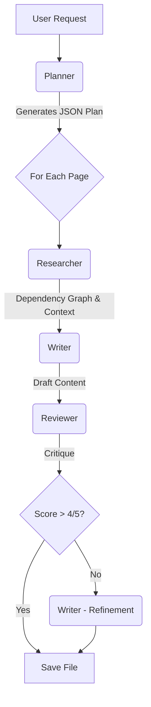

# AI Architecture: Model Routing (Planner/Writer)

The Sintesi CLI implements a "Model Routing" architecture to optimize the balance between cost, quality, and speed when interacting with AI models. This approach assigns specific AI models (with varying capabilities and costs) to distinct roles:

1.  **Planner (Architect)**: Reasoning and strategy.
2.  **Researcher**: Exploring dependency graphs and gathering context.
3.  **Writer (Builder)**: Efficient content generation.
4.  **Reviewer (Critique)**: Validating output against strict rules.

## Default Models (Configurable via Environment Variables)

The CLI automatically selects appropriate models based on the detected API key provider:

*   **OpenAI API Key (`OPENAI_API_KEY`)**:
    *   **Planner**: `o3-mini` (Reasoning).
    *   **Writer**: `gpt-4o-mini` (Fast generation).
    *   **Researcher**: `gpt-4o-mini` (Fast context gathering).
    *   **Reviewer**: `gpt-4o` (Critical analysis).
*   **Gemini API Key (`GEMINI_API_KEY`)**:
    *   **Planner**: `gemini-1.5-flash`
    *   **Writer**: `gemini-1.5-flash-001`
    *   **Researcher**: `gemini-1.5-flash-001`
    *   **Reviewer**: `gemini-1.5-pro`
*   **Anthropic API Key (`ANTHROPIC_API_KEY`)**:
    *   **Planner**: `claude-3-5-haiku-20241022`
    *   **Writer**: `claude-3-5-haiku-20241022`
    *   **Researcher**: `claude-3-5-haiku-20241022`
    *   **Reviewer**: `claude-3-5-sonnet-20241022`
*   **Mistral API Key (`MISTRAL_API_KEY`)**:
    *   **Planner**: `mistral-large-latest`
    *   **Writer**: `mistral-small-latest`
    *   **Researcher**: `mistral-small-latest`
    *   **Reviewer**: `mistral-large-latest`

You can override these defaults by setting `SINTESI_PLANNER_MODEL_ID` and `SINTESI_WRITER_MODEL_ID` in your environment variables.

## The Multi-Agent Workflow

When generating documentation (e.g., via `doctype documentation`), the agents collaborate in a structured pipeline:

1.  **Planner (The Architect)**:
    *   **Input**: `package.json`, file tree, git diff.
    *   **Action**: Decides the structure of the documentation site (e.g., "We need an API reference and a Getting Started guide").
    *   **Output**: A list of planned files with descriptions and relevant source paths.

2.  **Researcher**:
    *   **Input**: Relevant source paths from the Plan.
    *   **Action**: Traverses the `ProjectContext` dependency graph to find imported types, interfaces, and utilities that the Writer might need to understand the code fully.
    *   **Output**: A rich context block containing source code and relevant dependencies.

3.  **Writer (The Builder)**:
    *   **Input**: The Plan item + Researched Context.
    *   **Action**: Generates the actual Markdown content.

4.  **Reviewer (The Critic)**:
    *   **Input**: The Draft from the Writer.
    *   **Action**: Evaluates the content against strict criteria (Accuracy, Clarity, Consistency).
    *   **Output**: A Score (1-5) and specific critique.
    *   **Loop**: If the score is low, the Writer is triggered again to **refine** the content based on the critique before saving.

## Agent Roles in CLI Commands

Here is how the Planner and Writer roles are utilized across different CLI commands:

| Command | Uses Planner/Writer? | Planner Role (e.g., `o3-mini`)                                                                                                                                                 | Writer Role (e.g., `gpt-4o-mini`) | Main AI Input | Notes |
| :--- | :--- |:-------------------------------------------------------------------------------------------------------------------------------------------------------------------------------| :--- | :--- | :--- |
| **`documentation`** | **YES (Full)** | **The Architect**: Analyzes `package.json`, file structure, and dependency graph to define the strategy and optimal structure for a multi-page documentation site (JSON plan). | **The Builder**: Receives the detailed plan from the Planner, reads specific source code files and associated tests, and physically writes each Markdown page. | `package.json` + File Tree + Dependency Info (Planner) -> Source Code & Tests (Writer) | Leverages the architecture fully for maximum quality and cost efficiency. |
| **`check --smart`** | **YES (Partial)** | **The Inspector**: Analyzes `git diff` and the existing `README.md`. Determines if recent code changes introduce "drift" that makes the README obsolete.                       | *Not used* (the result is a JSON verdict, not generated text). | `git diff` + `README.md` content + Changed files list | Uses a more capable model to reduce false positives when detecting significant drift. |
| **`changeset`** | **YES (Partial)** | **The Analyst**: Analyzes symbol changes (via AST) and `git diff`. Decides on Semantic Versioning (Major/Minor/Patch) and generates a detailed changelog description.          | *Not used* (changelog is a JSON output and short description, handled by the Planner). | AST Symbol Changes + `git diff` | Uses an advanced reasoning model to ensure accuracy in versioning and change descriptions. |
| **`readme`** | **NO (Writer Only)** | *Not used* (task is considered simple enough for a single pass).                                                                                                               | **The Editor**: Reads all available context (`package.json`, file list with dependency info, `git diff`) and rewrites the full `README.md`. | `package.json` + File Tree + Dependency Info + `git diff` | Treated as a "monolithic" text generation task for a single file. Uses an efficient model to keep costs low. |
