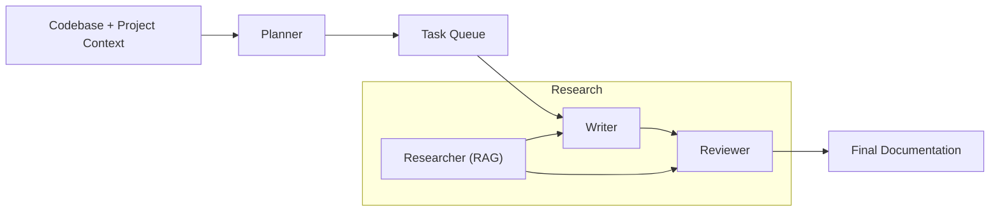
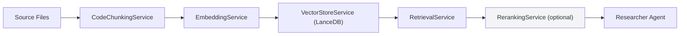

## Overview

This document describes the high‑level architecture of the Sintesi monorepo. It covers the on‑disk layout, the split between the Rust N‑API core and the TypeScript orchestration layer, the multi‑agent generation pipeline (Planner, Writer, Reviewer, Researcher), the Retrieval‑Augmented Generation (RAG) indexing and retrieval flow, and the main extension points available to integrate custom providers or to extend the pipeline.

<Callout type="info">
Sintesi stores CPU‑heavy logic in a Rust crate (`crates/core`) and exposes that logic to Node.js via NAPI. The TypeScript packages (CLI, services, and orchestration) use those bindings together with pure‑TS components (agents, RAG orchestration, CLI).
</Callout>

## Clone & quick build

Recommended quick steps to get a working dev build. The native build scripts in `crates/core` invoke Cargo under the hood (via napi/node build tooling). If you prefer, you can run Cargo directly.

```bash
# Clone the repository
git clone https://github.com/doctypedev/doctype.git
cd doctype

# Install workspace dependencies (use npm/yarn/pnpm as appropriate)
npm install

# Build the Rust core (from crates/core)
cd crates/core
npm install         # installs any node build tooling for the native package
npm run build       # runs the package's build script which invokes Cargo / napi build

# Alternative: build the Rust crate directly with cargo
# (useful for debugging or cross-compilation scenarios)
# From repo root:
cargo build --release --manifest-path crates/core/Cargo.toml
```

See `crates/core/README.md` for platform-specific packaging steps and cross‑compile notes. The `npm run build` script in `crates/core` typically wraps the native build (e.g., `napi build` or a script that calls Cargo), so Cargo is invoked implicitly when using the npm script.

## Monorepo structure (logical view)

A simplified view of the relevant workspace portions:

```
.
├── crates/
│   └── core/                # Rust core with NAPI bindings
│       ├── src/
│       │   ├── ast/         # AST analysis (Oxc parser)
│       │   ├── content/     # Markdown discovery/extraction
│       │   ├── context/     # Project context / crawler / graph / git
│       │   └── napi/        # NAPI bindings (exposes Rust -> Node)
│       └── README.md
├── packages/
│   ├── cli/                 # CLI & orchestrator (TypeScript)
│   └── core/                # TypeScript glue that loads native bindings
└── README.md
```

## Key architectural boundaries

- The **Rust core** (`crates/core`) implements CPU‑intensive and correctness‑sensitive features:
    - AST parsing and signature extraction.
    - Markdown anchor extraction (pulldown‑cmark).
    - Git analysis and change detection.
    - NAPI wrappers that expose safe, idiomatic Node APIs.

- The **TypeScript orchestration** (CLI + services):
    - Loads the platform binary via `native-loader` and re‑exports convenience types.
    - Implements higher‑level orchestration: multi‑agent pipeline, RAG orchestration, and CLI glue.
    - Coordinates external AI providers, embeddings, reranking, and vector‑store access.

- The **NAPI boundary** is intentionally thin: Rust performs analysis and returns compact typed data, while TypeScript composes and orchestrates business logic and network calls.

## Rust N‑API: usage examples

Note on naming conventions:

- In Rust the functions and fields are typically snake_case (e.g., `analyze_file`, `start_line`). The NAPI exports in `crates/core` are implemented in Rust and often use snake_case names.
- The TypeScript package `packages/core` loads the native bindings and re‑exports a JS-friendly surface that is camelCased (e.g., `analyzeFile`, `startLine`, `filePath`). The examples below show the camelCased JS surface used in the TypeScript orchestration; where helpful we also show the underlying Rust/snake_case name in comments.

Analyze a file or code snippet (AST):

```typescript
// Node.js (using the packages/core re-exported surface)
const { AstAnalyzer } = require('@sintesi/core'); // loaded via native-loader

const analyzer = new AstAnalyzer();

// JS-friendly camelCase methods (preferred in TypeScript code)
const signaturesFromFile = analyzer.analyzeFile('/path/to/src/index.ts');
const signaturesFromCode = analyzer.analyzeCode(`
export function login(user: string) {
  return user;
}
`);

// Equivalent underlying Rust NAPI function names (implemented in crates/core)
// analyzer.analyze_file(...) and analyzer.analyze_code(...)
```

Discover files in a project:

```typescript
const { discoverFiles } = require('@sintesi/core');

const result = discoverFiles(process.cwd(), {
    respectGitignore: true,
    includeHidden: false,
    maxDepth: 5,
});

console.log('Markdown files:', result.markdownFiles.length);
console.log('Source files:', result.sourceFiles.length);

// Underlying Rust binding may be discover_files; packages/core re-exports discoverFiles.
```

Extract Sintesi anchors from markdown content:

- JS objects returned by the NAPI surface use camelCase property names (e.g., startLine, endLine, filePath). This is the intended TS/JS surface used in the orchestration layer. Rust-side structs/fields will appear in snake_case names in Rust code.

```typescript
const { extractAnchors } = require('@sintesi/core');
const fs = require('fs');

const content = fs.readFileSync('docs/api.md', 'utf-8');
const extraction = extractAnchors('docs/api.md', content);

console.log('Found anchors:', extraction.anchorCount);
for (const anchor of extraction.anchors) {
    // JS camelCase properties (preferred)
    console.log(anchor.id, anchor.filePath, anchor.startLine, anchor.endLine);

    // Under the hood in Rust these fields are start_line, end_line, file_path, etc.
}
```

Parse a `code_ref` into parts:

```typescript
const { parseCodeRef } = require('@sintesi/core');

const { filePath, symbolName } = parseCodeRef('src/auth.ts#login');
console.log('File:', filePath); // -> "src/auth.ts"
console.log('Symbol:', symbolName); // -> "login"

// Underlying Rust return keys may be snake_case (file_path, symbol_name),
// but packages/core exports the camelCase JS surface.
```

## Multi‑Agent generation pipeline

Sintesi uses a multi‑agent approach where specialized agents collaborate:

- **Planner** — designs the documentation structure and tasks.
- **Writer** — generates the actual documentation content.
- **Reviewer** — verifies and improves generated outputs.
- **Researcher** — retrieves project context (RAG) to ground generation.

The high‑level flow:



Each agent is implemented/instantiated from the TypeScript orchestration layer and can use multiple AI providers. The Planner instructs the Researcher to collect relevant context for each documentation task.

<Callout type="info">
Agent initialization in the CLI respects environment variables and provider configuration. Agents are validated for connectivity during startup (see `getAIAgents` behavior in the TypeScript services).
</Callout>

## Retrieval‑Augmented Generation (RAG) / Indexing flow

RAG in Sintesi is implemented as a pipeline of services:

- **CodeChunkingService**: Splits source files into semantic chunks (functions, classes) using AST analysis.
- **EmbeddingService**: Produces embeddings (e.g., `text-embedding-3-small`) via an OpenAI‑compatible API.
- **VectorStoreService**: Persist embeddings and metadata (LanceDB is used in the codebase).
- **RerankingService**: Optional reranking using Cohere (if `COHERE_API_KEY` is provided).
- **RetrievalService**: Orchestrates the end‑to‑end retrieval for queries.

Flow diagram:



Practical orchestration example (TypeScript pseudo‑usage):

```typescript
import { RetrievalService } from './services/rag';
const service = new RetrievalService(logger, process.cwd());

await service.indexProject(); // index the repo into .sintesi/lancedb
const context = await service.retrieveContext('How does authentication work?');
```

Environment variables relevant to RAG and agents:

| Name                       | Required? | Purpose                                                                |
| -------------------------- | --------- | ---------------------------------------------------------------------- |
| `OPENAI_API_KEY`           | Yes       | Used by the `EmbeddingService` for OpenAI‑compatible embeddings.       |
| `COHERE_API_KEY`           | Optional  | If provided, `RerankingService` can call Cohere for result re‑ranking. |
| `SINTESI_PLANNER_MODEL_ID` | Optional  | Planner model override (env used during agent initialization).         |
| `SINTESI_WRITER_MODEL_ID`  | Optional  | Writer model override (env used during agent initialization).          |
| `SINTESI_PLANNER_PROVIDER` | Optional  | Planner provider identifier.                                           |
| `SINTESI_WRITER_PROVIDER`  | Optional  | Writer provider identifier.                                            |

## Extension points

Sintesi is designed to be extensible at multiple layers:

1. **AI Providers**
    - The orchestration layer supports pluggable providers (OpenAI‑compatible, Vercel AI, etc.). Provider implementations (see the providers code under `packages/ai` or `packages/providers`) contain fallback and retry strategies — for example, Helicone fallback behavior and provider fallback paths are implemented in those provider modules. To add a provider, implement the provider interface used by the `genai` layer and register it in the provider factory.

2. **Vector Store**
    - The current implementation uses LanceDB via `VectorStoreService`. You can add a new store backend by implementing the `VectorStore` interface in the `packages/cli` services (or the relevant services package) and wiring it into `RetrievalService`.

3. **NAPI / Native Extensions**
    - New Rust modules can be added under `crates/core/src/` and exported via `crates/core/src/napi/`. NAPI wrappers expose Rust functions/types to TypeScript; follow existing patterns (`ast.rs`, `content.rs`) for bindings and JS doc comments.

4. **Agent Pipeline Hooks**
    - The orchestration separates planning, writing, and reviewing steps. Hooks can be inserted between steps (e.g., pre‑write retrieval, post‑write verification) by extending the pipeline orchestrator in the CLI services.

5. **Git / Incremental Indexing**
    - `GitBinding` exists in the core exports and is used for incremental indexing (only process changed files). Implement additional diff strategies by enhancing `crates/core/src/git` and exposing new NAPI calls as needed.

## NAPI surface & re‑exports (TypeScript)

The TypeScript package `packages/core` loads and re‑exports the native bindings. Typical exported items you will see in the codebase. Note: the right‑hand column shows the JS/TS surface name; Rust/NAPI implementations commonly use snake_case names internally.

| Export (JS surface)           | Notes / Rust NAPI name                                                                                                                                            |
| ----------------------------- | ----------------------------------------------------------------------------------------------------------------------------------------------------------------- |
| `AstAnalyzer`                 | Class that exposes JS-friendly methods: `analyzeFile` / `analyzeCode` / `analyzeWithErrors`. Underlying Rust functions may be `analyze_file`, `analyze_code`.     |
| `discoverFiles`               | Discover markdown and source files with optional discovery options (Rust: `discover_files`).                                                                      |
| `extractAnchors`              | Extract Sintesi anchors from markdown text (Rust: `extract_anchors`). Returned anchor objects use camelCase properties in JS: `filePath`, `startLine`, `endLine`. |
| `validateMarkdownAnchors`     | Fast validation of markdown anchors (no extraction).                                                                                                              |
| `parseCodeRef`                | Parse `file#symbol` references into parts. JS return fields use camelCase: `filePath`, `symbolName` (Rust: `parse_code_ref` returns `file_path`, `symbol_name`).  |
| `getProjectContext`           | Returns a `ProjectContext` with `FileContext` entries.                                                                                                            |
| `GitBinding`, `GraphAnalyzer` | Native helpers exposed for Git diffs and graph analysis.                                                                                                          |

When writing TypeScript orchestration code prefer the camelCase JS surface re‑exports from `packages/core`. If you call the native package directly from Node, be aware that the low‑level names exported by the Rust crate may use snake_case; the TypeScript package normalizes and documents the JS-friendly surface.

## Best practices

- Use the Rust core for heavy analysis (AST, chunking, markdown parsing) and keep orchestration (network calls, retries, provider selection) in TypeScript.
- Persist vector indices (`.sintesi/lancedb`) and keep an index state (e.g., last processed commit SHA) to support efficient incremental indexing.
- Validate AI agents at startup (agent connectivity checks are implemented in `getAIAgents` logic).
- Keep prompt templates and discovery prompts in the planner layer. The repository contains `DOC_DISCOVERY_PROMPT` usages referenced by the planner.

## Troubleshooting & notes

- If embedding or reranking fails, provider implementations include fallback and retry strategies. Check the provider implementations under `packages/ai` (or the provider modules) for exact behavior and logs related to Helicone or other fallback paths.
- Native bindings require platform builds. Use `crates/core/README.md` build instructions and the `npm run build` scripts inside `crates/core` to produce platform packages. The `npm run build` script typically invokes Cargo/NAPI tooling; if you need finer control, build with Cargo directly as shown above.

---

If you plan to extend Sintesi, start from one of these entry points:

- Add a new NAPI binding in `crates/core/src/napi/` and update `mod.rs`.
- Extend the RAG pipeline in `packages/cli/src/services/rag/`.
- Implement a new AI provider and register it where providers are initialized (see `packages/ai` provider implementations).

This architecture intentionally separates analysis (deterministic, local, Rust) from orchestration (networked, probabilistic, TypeScript) to keep the system fast, auditable, and extensible.
