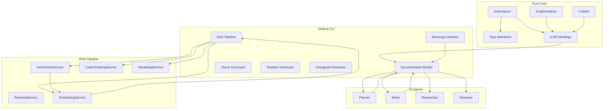

# Architecture Overview

This document presents a high-level view of the Sintesi stack, focusing on how the Rust core (exposed to Node.js via N-API), the CLI tooling, the Retrieval-Augmented Generation (RAG) pipeline, multi-agent AI orchestration, and monorepo-aware analysis collaborate to enable end-to-end documentation generation and maintenance.

**Key architectural features:**

- **Rust Core**: Safe, high-performance primitives exposed to Node.js via N-API bindings.
- **Node.js CLI**: Orchestrates discovery, analysis, generation, validation, and repository-wide checks.
- **RAG Pipeline**: Context-aware documentation creation using semantic retrieval.
- **Multi-agent AI**: Planner, Writer, Researcher, and Reviewer agents collaborate.
- **Monorepo-aware Analysis**: Adapts behavior based on repo structure and package layout.

---

## 1. System Boundaries and Core Responsibilities

### Rust Core (N-API bindings)

Exposes performance-critical primitives and analysis facilities to Node.js.

- **Components**: AST analysis, signature extraction, hashing, dependency graph utilities, content discovery.
- **N-API Surface**:
    - `AstAnalyzer`: AST-based analysis for TS/JS.
    - `GraphAnalyzer`: Dependency graph queries.
    - `Crawler`: Repository/content discovery helper.
- **Data Types**: `CodeSignature`, `AnalysisResultJs`.

### Node CLI (`packages/cli`)

Orchestrates end-to-end workflows.

- **Commands**:
    - `documentation`: Generation.
    - `readme`: Scaffolding.
    - `check`: Drift detection.
    - `changeset`: AI-assisted generation.
- **Role**: Integrates monorepo analysis and drives the AI agents.

### RAG Pipeline (CLI-based)

Powers context provision for generation.

- **Components**:
    - `RetrievalService` (Orchestrator)
    - `VectorStoreService` (LanceDB)
    - `EmbeddingService`
    - `CodeChunkingService`
    - `RerankingService`

### AI Orchestration (AI Agents)

Multi-agent roles implemented via the `AIAgent` abstraction.

- **Planner**: Plans documentation structure.
- **Writer**: Generates content.
- **Researcher**: Performs architectural discovery.
- **Reviewer**: Critiques and refines drafts.

### Monorepo-aware Analysis

- Detects repo layout (monorepo vs. single package).
- Identifies CLI binaries and entry points.
- Guides changeset generation and planning.

---

## 2. Architecture Diagrams



---

## 3. API Surface (N-API Bindings)

The Rust core exposes the following bindings to Node.js.

### `AstAnalyzer`

```typescript
class AstAnalyzer {
    constructor();
    analyze_file(filePath: string): Promise<CodeSignature[]>;
    analyze_code(code: string): Promise<CodeSignature[]>;
    analyze_with_errors(code: string): Promise<AnalysisResultJs>;
}
```

### `GraphAnalyzer`

```typescript
class GraphAnalyzer {
    constructor(rootPath: string);
    get_dependents(filePath: string, allFiles: string[]): Promise<string[]>;
    get_dependencies(filePath: string, allFiles: string[]): Promise<string[]>;
}
```

### Data Types

```typescript
interface CodeSignature {
    symbol_name: string;
    symbol_type: string;
    signature_text: string;
    is_exported: boolean;
    hash?: string;
}

interface AnalysisResultJs {
    signatures: CodeSignature[];
    errors: string[];
}
```

---

## 4. Usage Examples (Node.js)

### Example 1: Analyze Code Snippet

```javascript
const { AstAnalyzer } = require('path-to-napi-bindings');
const analyzer = new AstAnalyzer();
const sigs = await analyzer.analyze_code(
    'export function greet(name: string) { return `Hello ${name}`; }',
);
console.log(sigs);
// Output: CodeSignature[] with hashes
```

### Example 2: Analyze Dependencies

```javascript
const { GraphAnalyzer } = require('path-to-napi-bindings');
const graph = new GraphAnalyzer('/workspace');
const deps = await graph.get_dependencies('/workspace/src/main.ts', [
    '/workspace/package.json',
    '/workspace/src/main.ts',
]);
console.log(deps);
// Output: list of dependency file paths
```

---

## 5. Data Flows

### From Source to Analysis

1.  TS/JS sources analyzed by Rust AST subsystem.
2.  Symbols extracted, signatures normalized, hashes computed.
3.  `CodeSignature` objects returned to Node.js.

### From Analysis to Documentation

1.  RAG context gathered (source code + semantic retrieval).
2.  Planner plans structure.
3.  Writer generates content.
4.  Reviewer refines drafts.
5.  Documentation Builder persists to disk.

### Monorepo Awareness

1.  `MonorepoDetector` inspects layout.
2.  Identifies packages and CLI binaries.
3.  Outputs drive changeset generation and docs scaffolding.

---

## 6. Internal References

**Rust Core**: `crates/core/src/napi/` (`ast.rs`, `graph.rs`, `crawler.rs`, `utils.rs`)

**Node CLI**:

- **Monorepo**: `packages/cli/src/services/monorepo-detector.ts`
- **RAG**: `packages/cli/src/services/rag/`
- **AI**: `packages/ai/ai-agent.ts`, `packages/cli/src/services/generation-context.ts`
- **Commands**: `packages/cli/src/commands/` (`check.ts`, `documentation.ts`, `changeset.ts`)

::: info Important
All concrete flags and parameters above are drawn from the repository context. Use these mappings to align documentation and diagrams with the actual codebase.
:::
