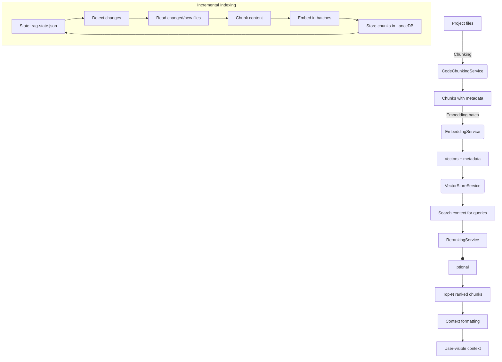

# Retrieval-Augmented Generation (RAG)

The Retrieval-Augmented Generation (RAG) subsystem is the semantic layer powering Sintesi's contextual understanding. It converts source code and documents into semantic chunks, embeds them into a vector store, retrieves relevant context for a query, optionally reranks results for better fidelity, and manages incremental indexing state to avoid reembedding unchanged content.

## Key Goals

- Efficiently index and search large code bases and Markdown content.
- Provide meaningful, contextual outputs for user queries by combining exact match signals with semantic similarity.
- Allow configurable embedding and reranking providers via environment variables and code-level defaults.
- Maintain lightweight, incremental indexing state to minimize rework on subsequent runs.

## Architecture Overview



## Components

### CodeChunkingService

**Purpose**: Split TS/JS source files into meaningful chunks using an AST-based approach.

**How it chunks**:

- **Functions**: Creates chunks per function (name, full text, start/end lines).
- **Classes**: Chunks by class, optionally splitting into individual methods if the class is large (> 300 lines).
- **Top-level**: Arrow functions and function expressions declared as top-level variables are captured as chunks.

**Fallback**: Non-code files result in a single chunk containing the whole file content (with functionName 'FILE_CONTENT').

**Output Shape**: `content`, `startLine`, `endLine`, `functionName`.

### EmbeddingService

**Purpose**: Produce vector embeddings for text chunks.

- **Default model**: `text-embedding-3-small`.
- **Provider**: OpenAI-compatible API (via `createOpenAI`). Reads `OPENAI_API_KEY` from environment; warns if missing.
- **Batching**: `embedDocuments` accepts an array of strings; internally uses `embedMany` to batch embeddings.
- **Output**: A 2D array of embeddings (one vector per input text).

### VectorStoreService (LanceDB)

**Purpose**: Persist and retrieve embeddings and associated chunk metadata locally.

- **Location**: `.sintesi/lancedb` in the project root.
- **Core Operations**:
    - `addChunks(chunks)`: Append new chunks.
    - `deleteChunks(ids)`: Remove stale chunks by IDs.
    - `search(queryVector, limit)`: Vector-based similarity search.

### RerankingService

**Purpose**: Improve relevance ordering of candidate chunks using a language-model-based reranking.

- **Provider**: Cohere (`COHERE_API_KEY`).
- **Model**: `rerank-english-v3.0`.
- **Behavior**:
    - If `COHERE_API_KEY` is missing, falls back to the original vector-order without reranking.
    - If available, asks Cohere to rerank and returns the indices of the top results.

### IndexingStateManager

**Purpose**: Persist incremental indexing state to avoid re-embedding unchanged content.

- **State File**: `.sintesi/rag-state.json`
- **Data Model**:
    - `IndexState`: `version`, `lastCommitSha`, `files`
    - `FileState`: `lastModified`, `chunkIds`

### RetrievalService

**Orchestrator** that ties chunking, embedding, vector search, and reranking together.

- **`indexProject()`**: Incremental indexer.
    - Checks `git rev-parse HEAD` and workspace dirty status.
    - Uses Rust `GitBinding` (primary) or file timestamps (fallback) to detect changes.
    - Handle deletions (remove stale chunks) and updates (chunk, embed, store).
- **`retrieveContext(query, limit = 5)`**: Returns a formatted context string.
    - Embeds query, searches (20 results), reranks (optional), selects top results.

## Usage Patterns

### Quick Start

```typescript
// Instantiate the RAG system
const service = new RetrievalService(new Logger(), process.cwd());

// Index the project (periodically or on significant changes)
await service.indexProject();

// Retrieve context for a query
const context = await service.retrieveContext('How does authentication work?');
```

### Configuration

| Feature             | Key / Config      | Details                                                                          |
| :------------------ | :---------------- | :------------------------------------------------------------------------------- |
| **Embeddings**      | `OPENAI_API_KEY`  | Required. Uses `text-embedding-3-small`. Configurable in `embedding-service.ts`. |
| **Reranking**       | `COHERE_API_KEY`  | Optional. Uses `rerank-english-v3.0`.                                            |
| **Batching**        | `TEXTS_PER_BATCH` | Hardcoded to 20 in `RetrievalService.indexProject`.                              |
| **Reranking Limit** | `limit`           | Default 5 in `retrieveContext`.                                                  |

### Data Model

**CodeChunk Interface**:

```typescript
interface CodeChunk {
    id: string;
    content: string;
    filePath: string;
    startLine: number;
    endLine: number;
    functionName: string;
    vector: number[]; // Populated after embedding
}
```

**Indexing State**:

```typescript
interface IndexState {
    lastCommitSha?: string;
    files: Record<string, FileState>;
}

interface FileState {
    lastModified: number;
    chunkIds: string[];
}
```

## Security and Reliability

- **Credentials**: Relies on `OPENAI_API_KEY` and `COHERE_API_KEY` in the environment.
- **Efficiency**: Incremental indexing avoids re-embedding unchanged content.
- **Graceful Degradation**:
    - Embeddings errors bubble up.
    - Reranking failure falls back to vector-order results.
- **Local Storage**: Vector store uses LanceDB at `.sintesi/lancedb`.

::: info Important
This documentation reflects the actual implementation and flags present in the repository context provided.
:::
