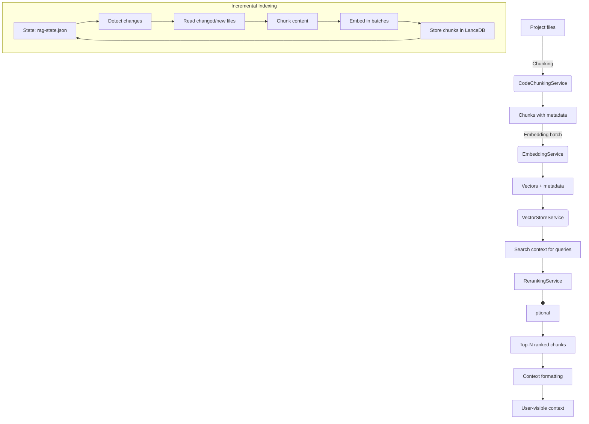

# Retrieval-Augmented Generation (RAG)

The Retrieval-Augmented Generation (RAG) subsystem is the semantic layer powering Sintesi's contextual understanding. It converts source code and documents into semantic chunks, embeds them into a vector store, retrieves relevant context for a query, optionally reranks results for better fidelity, and manages incremental indexing state to avoid reembedding unchanged content.

## Key Goals

- Efficiently index and search large code bases and Markdown content.
- Provide meaningful, contextual outputs for user queries by combining exact match signals with semantic similarity.
- Allow configurable embedding and reranking providers via environment variables and code-level defaults.
- Maintain lightweight, incremental indexing state to minimize rework on subsequent runs.

## Architecture Overview



## Components

### CodeChunkingService

**Purpose**: Split TS/JS source files into meaningful chunks using an AST-based approach.

**How it chunks**:

- **Functions**: Creates chunks per function (name, full text, start/end lines). Chunk content is prefixed (e.g. `Function {name}: ...`) to provide a clear descriptor for embeddings.
- **Classes**: Chunks by class; if a class spans more than ~300 lines it is split into individual method chunks to keep granularity useful for retrieval.
- **Top-level**: Arrow functions and function expressions declared as top-level variables are captured as chunks (prefixed with `Function (Arrow) {name}: ...`).

**Non-TypeScript fallback**: For non-TS/JS files the chunker no longer returns a single blob. Instead it splits content into paragraph-like blocks with a maximum chunk size (≈2000 characters) and annotates these blocks with `functionName: 'TEXT_BLOCK'`. This keeps chunks manageable for embedding and retrieval.

**Output Shape (from the chunker)**:

- content: string
- startLine: number
- endLine: number
- functionName: string

Note: The chunker output is intentionally minimal and does not include vector data, ids, or file path fields. Those are added later as the data flows through embedding and persistence layers. See the Data Model section for explicit mappings.

### EmbeddingService

**Purpose**: Produce vector embeddings for text chunks.

- **Default model**: `text-embedding-3-small`.
- **Provider**: OpenAI-compatible API (via `createOpenAI`). Reads `OPENAI_API_KEY` from environment; warns if missing.
- **Helicone proxy support**: If `HELICONE_API_KEY` (or equivalent Helicone integration env var) is present in the environment, the OpenAI client is configured to route embedding requests through the Helicone proxy. In that case, embedding requests are sent via Helicone's proxy endpoint and authenticated using the Helicone key. This proxying is optional and only enabled when the Helicone key is provided.
- **Batching**: `embedDocuments` accepts an array of strings; internally it delegates to batching logic (`embedMany` or equivalent) to avoid sending extremely large single requests. The concrete batch size is an implementation detail — older versions of the codebase commonly used a batch size of 20, but that value may be defined as a constant (for example `TEXTS_PER_BATCH`) in the current repository or managed dynamically by the embedding client. Check `RetrievalService.indexProject`/`EmbeddingService` in your checkout to see the actual batch size used at runtime.
- **Output**: A 2D array of embeddings (one vector per input text).

### VectorStoreService (LanceDB)

**Purpose**: Persist and retrieve embeddings and associated chunk metadata locally.

- **Location**: `.sintesi/lancedb` in the project root.
- **Core Operations**:
    - `addChunks(chunks)`: Append new chunks (chunk metadata + vectors).
    - `deleteChunks(ids)`: Remove stale chunks by IDs.
    - `search(queryVector, limit)`: Vector-based similarity search; returns stored chunk metadata together with similarity scores.

Important: The VectorStore holds the authoritative "stored" shape of a chunk (including id, file path, vector, and any store-managed metadata). This shape differs from the raw chunker output. See the Data Model section for explicit interfaces.

### RerankingService

**Purpose**: Improve relevance ordering of candidate chunks using a language-model-based reranking.

- **Provider**: Cohere (`COHERE_API_KEY`).
- **Model**: `rerank-english-v3.0`.
- **Behavior**:
    - If `COHERE_API_KEY` is missing, falls back to the original vector-order without reranking.
    - If available, asks Cohere to rerank and returns the indices of the top results.

### IndexingStateManager

**Purpose**: Persist incremental indexing state to avoid re-embedding unchanged content.

- **State File**: `.sintesi/rag-state.json`
- **Data Model**:
    - `IndexState`: `version`, `lastCommitSha`, `files`
    - `FileState`: `lastModified`, `chunkIds`

### RetrievalService

**Orchestrator** that ties chunking, embedding, vector search, and reranking together.

- **`indexProject()`**: Incremental indexer.
    - Checks `git rev-parse HEAD` and workspace dirty status.
    - Uses Rust `GitBinding` (primary) or file timestamps (fallback) to detect changes.
    - Handles deletions (remove stale chunks) and updates (chunk, embed, store).
    - Embedding is performed in batches. The effective batch size is determined by the embedding/batching implementation in your checkout (see EmbeddingService notes above).
- **`retrieveContext(query, limit = 5)`**: Returns a formatted context string.
    - Embeds query, performs a vector search to gather a candidate set (commonly a few dozen candidates — for example 20 in prior snapshots — but the exact candidate-set size may be configurable).
    - Optionally reranks candidates using the RerankingService and then selects the top `limit` results to format into a context string.

## Usage Patterns

### Quick Start

```typescript
// Instantiate the RAG system
const service = new RetrievalService(new Logger(), process.cwd());

// Index the project (periodically or on significant changes)
await service.indexProject();

// Retrieve context for a query
const context = await service.retrieveContext('How does authentication work?');
```

### Configuration

| Feature             | Key / Config             | Details                                                                                                                                                                                                                 |
| :------------------ | :----------------------- | :---------------------------------------------------------------------------------------------------------------------------------------------------------------------------------------------------------------------- |
| **Embeddings**      | `OPENAI_API_KEY`         | Required for OpenAI-compatible embeddings. Uses `text-embedding-3-small` by default.                                                                                                                                    |
| **Helicone proxy**  | `HELICONE_API_KEY`       | Optional. If present, embedding requests are routed through a Helicone proxy and the client is configured to use that proxy and the provided key for proxy authentication.                                              |
| **Reranking**       | `COHERE_API_KEY`         | Optional. Uses `rerank-english-v3.0`.                                                                                                                                                                                   |
| **Batching**        | Implementation-dependent | Embedding batching is performed by the EmbeddingService (via `embedMany`/`embedDocuments`). Some versions use a constant (e.g., `TEXTS_PER_BATCH = 20`), but the batch size should be confirmed in the repository code. |
| **Reranking Limit** | `limit`                  | Default 5 in `retrieveContext`.                                                                                                                                                                                         |

### Data Model

The runtime data shape changes as data flows through the pipeline. The chunker, embedding service, and vector store each contribute fields. To avoid confusion, these are shown as separate interfaces:

- Chunk produced by the chunker (the minimal, language/AST-derived unit):

```typescript
interface Chunk {
    content: string;
    startLine: number;
    endLine: number;
    functionName: string; // e.g. 'myFunc' or 'TEXT_BLOCK' for non-code
}
```

- Stored chunk in the vector store (the shape persisted and retrieved from LanceDB / vector store). This is the structure consumers of search results will typically see. The exact fields may vary by implementation of the VectorStore, but commonly include:

```typescript
interface VectorStoreCodeChunk {
    id: string; // generated by the vector store or indexer
    filePath?: string; // source file path (added by the indexer)
    content: string;
    startLine?: number;
    endLine?: number;
    functionName?: string;
    vector?: number[]; // present once embedding has been produced and stored
    // additional store-managed metadata may exist (timestamps, model used, insertion id, etc.)
}
```

Notes on lifecycle and mapping:

- The chunker emits Chunk objects (content + positional metadata). These do not include ids, file paths, or vectors.
- During indexing, the Indexer/Retention layer enriches each Chunk with provenance (e.g., filePath) and assigns an id before sending text to the EmbeddingService.
- EmbeddingService produces vectors for a batch of chunk contents. These vectors are then attached to the corresponding chunk records and persisted into the VectorStore as VectorStoreCodeChunk entries.
- The `vector` field exists only on stored/embedded chunks; freshly chunked-only objects will not have a vector until they have been sent to the embedding provider and persisted.

### Indexing State

```typescript
interface IndexState {
    lastCommitSha?: string;
    files: Record<string, FileState>;
}

interface FileState {
    lastModified: number;
    chunkIds: string[];
}
```

## Security and Reliability

- **Credentials**: Relies on `OPENAI_API_KEY` and `COHERE_API_KEY` in the environment. `HELICONE_API_KEY` is optional and enables Helicone proxying for embedding traffic when present.
- **Efficiency**: Incremental indexing avoids re-embedding unchanged content.
- **Graceful Degradation**:
    - Embeddings errors currently bubble up; callers should handle or retry as appropriate.
    - Reranking failure falls back to vector-order results.
- **Local Storage**: Vector store uses LanceDB at `.sintesi/lancedb`.

::: info Important
This documentation reflects the implementation patterns and flags commonly seen in the repository. Some operational details (exact batch sizes, constant names like `TEXTS_PER_BATCH`, and additional store-managed metadata) can vary between commits — consult the `EmbeddingService`, `RetrievalService.indexProject`, and `VectorStore` implementations in your checkout for the precise runtime constants and shapes.
:::
