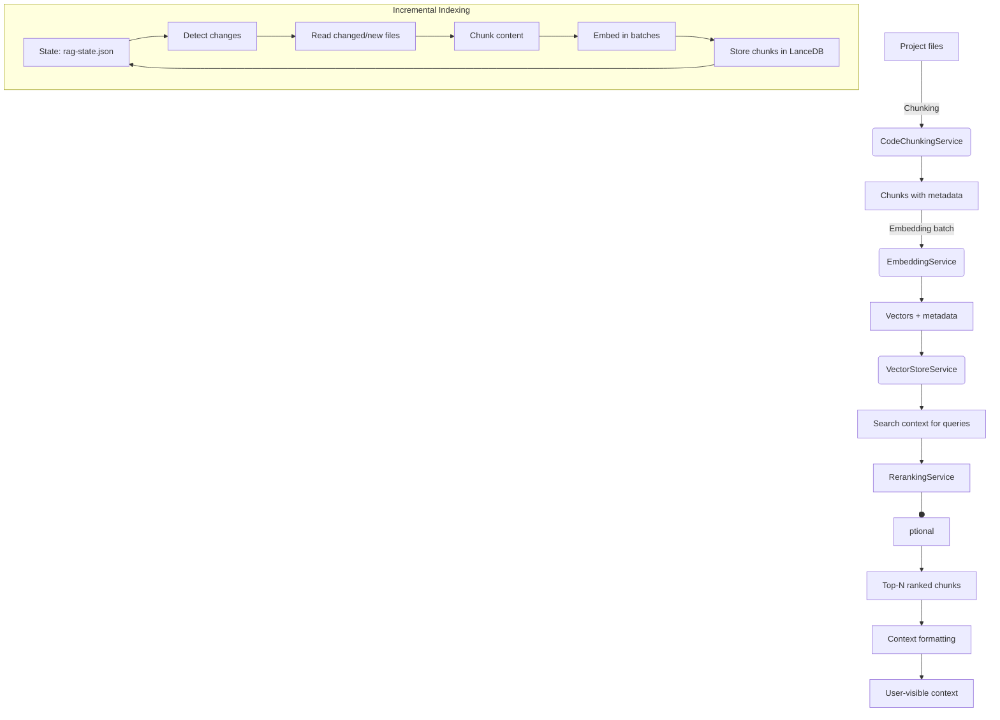

# Retrieval-Augmented Generation (RAG)

The Retrieval-Augmented Generation (RAG) subsystem is the semantic layer powering Sintesi's contextual understanding. It converts source code and documents into semantic chunks, embeds them into a vector store, retrieves relevant context for a query, optionally reranks results for better fidelity, and manages incremental indexing state to avoid reembedding unchanged content.

## Key Goals

- Efficiently index and search large code bases and Markdown content.
- Provide meaningful, contextual outputs for user queries by combining exact match signals with semantic similarity.
- Allow configurable embedding and reranking providers via environment variables and code-level defaults.
- Maintain lightweight, incremental indexing state to minimize rework on subsequent runs.

## Architecture Overview



## Components

### CodeChunkingService

**Purpose**: Split TS/JS source files into meaningful chunks using an AST-based approach (ts-morph).

**How it chunks**:

- **Functions**: Creates chunks per function (includes the function name, full text including JSDoc, and start/end lines). The chunk content is prefixed with a short descriptor (e.g. "Function <name>: <body>") to improve embedding signals.
- **Classes**: Chunks by class declaration. For very large classes (> 300 lines) the implementation splits into method-level chunks instead of taking the whole class.
- **Top-level**: Arrow functions and function expressions assigned to top-level variables are captured as function-like chunks.

Implementation notes:

- The TS/JS chunker constructs an in-memory ts-morph Project (ScriptTarget ES2022) and creates source files in-memory for AST analysis. This avoids touching the on-disk project configuration while still producing semantic chunks.
- On parse/analysis failure the chunker falls back to a single-file chunk with functionName 'FILE_FALLBACK'.

First-class Non-TypeScript/JavaScript chunking: Plain text and other non-TS/JS files are chunked by paragraphs/blocks into one or more chunks. These chunks are treated as a first-class capability (not merely a fallback) and are labeled with functionName 'TEXT_BLOCK' so they can be indexed and retrieved alongside code chunks with appropriate semantics.

**Output Shape**: `content`, `startLine`, `endLine`, `functionName`.

### EmbeddingService

**Purpose**: Produce vector embeddings for text chunks.

- **Default model**: `text-embedding-3-small`.
- **Provider**: OpenAI-compatible API (via `createOpenAI`). Reads `OPENAI_API_KEY` from environment; warns if missing.
- **Helicone proxy**: If `HELICONE_API_KEY` is present the service routes embedding requests through Helicone by setting a custom baseURL and headers (including `Helicone-Auth` and `Helicone-Cache-Enabled`). This is used to enable caching/monitoring proxies in CI or developer environments.
- **Batching**: `embedDocuments` accepts an array of strings and relies on `embedMany` from the `ai` package for batching. For very large arrays manual chunking may still be required.
- **Output**: A 2D array of embeddings (one vector per input text).

### VectorStoreService (LanceDB)

**Purpose**: Persist and retrieve embeddings and associated chunk metadata locally.

- **Location**: `.sintesi/lancedb` in the project root.
- **Core Operations**:
    - `addChunks(chunks)`: Append new chunks.
    - `deleteChunks(ids)`: Remove stale chunks by IDs.
    - `search(queryVector, limit)`: Vector-based similarity search.

### RerankingService

**Purpose**: Improve relevance ordering of candidate chunks using a language-model-based reranking.

- **Provider**: Cohere (`COHERE_API_KEY`).
- **Model**: `rerank-english-v3.0`.
- **Behavior**:
    - If `COHERE_API_KEY` is present the service calls Cohere's rerank API and maps the returned ranking back to the candidate list.
    - If `COHERE_API_KEY` is missing or the remote rerank call fails, the implementation falls back to a lightweight local keyword-based reranker instead of simply returning the original vector order. This local reranker:
        - Normalizes query and documents to lowercase and strips punctuation.
        - Filters out short stop-like terms (keeps terms longer than 2 characters).
        - Gives a large bonus for an exact phrase match of the whole query (+10) and +1 for each unique query term found in the document.
        - Sorts by score (descending) with stable tie-breaking by original index and returns the top-N indices.

### IndexingStateManager

**Purpose**: Persist incremental indexing state to avoid re-embedding unchanged content.

- **State File**: `.sintesi/rag-state.json`
- **Data Model**:
    - `IndexState`: `version`, `lastCommitSha`, `files`
    - `FileState`: `lastModified`, `chunkIds`

### RetrievalService

**Orchestrator** that ties chunking, embedding, vector search, and reranking together.

- **`indexProject()`**: Incremental indexer.
    - Checks `git rev-parse HEAD` and workspace dirty status.
    - Uses Rust `GitBinding` (primary) or file timestamps (fallback) to detect changes.
    - Handle deletions (remove stale chunks) and updates (chunk, embed, store).
- **`retrieveContext(query, limit = 5)`**: Returns a formatted context string.
    - Embeds query, searches (20 results), reranks (optional), selects top results.

### Context budgeting (retrieval budgeting)

To make retrievals predictable and bound the amount of context supplied to the LLM, RetrievalService applies an explicit budgeting approach:

- The vector search uses a retrieval budget (default: 20 candidates). This is the number of nearest-neighbour documents retrieved from the vector store for downstream reranking.
- Any optional reranking step operates only on that fixed candidate set (the 20-result budget).
- After reranking, the service selects the top-N items from the reranked list to assemble the final context (N defaults to the `limit` parameter of `retrieveContext`, commonly 5).
- These parameters are configurable (the 20-result budget is controlled by `TEXTS_PER_BATCH` in the indexer/config and the final N is the `limit` argument), so the system can be tuned for larger or tighter context windows depending on model and prompt constraints.

This explicit two-stage approach (budget candidates -> rerank -> pick top-N) ensures the cost and token footprint of context assembly are controlled and reproducible.

## Usage Patterns

### Quick Start

```typescript
// Instantiate the RAG system
const service = new RetrievalService(new Logger(), process.cwd());

// Index the project (periodically or on significant changes)
await service.indexProject();

// Retrieve context for a query
const context = await service.retrieveContext('How does authentication work?');
```

### Configuration

| Feature             | Key / Config      | Details                                                                          |
| :------------------ | :---------------- | :------------------------------------------------------------------------------- |
| **Embeddings**      | `OPENAI_API_KEY`  | Required. Uses `text-embedding-3-small`. Configurable in `embedding-service.ts`. |
| **Reranking**       | `COHERE_API_KEY`  | Optional. Uses `rerank-english-v3.0`.                                            |
| **Batching**        | `TEXTS_PER_BATCH` | Hardcoded to 20 in `RetrievalService.indexProject`.                              |
| **Reranking Limit** | `limit`           | Default 5 in `retrieveContext`.                                                  |

### Data Model

To reflect the staged processing pipeline, the documentation distinguishes pre-embedding chunk shapes from the stored, post-embedding chunk shape.

- Chunk (pre-embedding): produced by CodeChunkingService and passed to the embedding step. Minimal metadata necessary for chunking and embedding.
- StoredCodeChunk (post-embedding): attached with storage-specific metadata (id, filePath) and the embedding vector once embedding has been performed; this is the shape persisted in the vector store.

Example TypeScript shapes:

```typescript
// Produced by the CodeChunkingService (pre-embedding)
interface Chunk {
    content: string;
    startLine: number;
    endLine: number;
    functionName: string; // e.g. "Function foo", "Class Bar", or "TEXT_BLOCK"
    // Note: filePath and vector are not included here in the chunker output;
    // the chunker emits content + location metadata which the indexer later enriches.
}
```

```typescript
// Stored in the vector store (post-embedding / indexed)
interface StoredCodeChunk {
    id: string; // assigned by the indexer/vector store
    content: string;
    filePath?: string; // attached by the indexer when persisting; may be undefined for some non-file sources
    startLine?: number;
    endLine?: number;
    functionName: string;
    vector: number[]; // Populated after embedding and before/when stored in LanceDB
}
```

Notes:

- The chunker focuses on textual and locational metadata; filePath and vector fields are attached by the indexer and embedding pipeline when the chunk is prepared for storage in the vector store.
- This staged separation avoids duplicating large vectors during chunking and keeps the chunking service focused on syntactic/semantic splitting.

**Indexing State**:

```typescript
interface IndexState {
    lastCommitSha?: string;
    files: Record<string, FileState>;
}

interface FileState {
    lastModified: number;
    chunkIds: string[];
}
```

## Security and Reliability

- **Credentials**: Relies on `OPENAI_API_KEY` and `COHERE_API_KEY` in the environment.
- **Efficiency**: Incremental indexing avoids re-embedding unchanged content.
- **Graceful Degradation**:
    - Embeddings errors bubble up.
    - Reranking failure falls back to vector-order results (or a local keyword-based reranker if configured/failing over as described).
- **Local Storage**: Vector store uses LanceDB at `.sintesi/lancedb`.

::: info Important
This documentation reflects the actual implementation and flags present in the repository context provided.
:::
