<Callout type="info">This guide assumes you are developing from the repository root at "https://github.com/doctypedev/doctype.git" and that you use `pnpm` as package manager (`pnpm@8.15.5` is recorded in the repo).</Callout>

## Overview

This document explains the typical developer flow for:

- Building the full workspace (`pnpm -r build`)
- Running tests (workspace-wide and package-specific) and how Vitest is configured for the CLI package
- Building/linking the Rust native core used by `@sintesi/core`
- Running the CLI locally during development

Follow the short step-by-step procedures below to get a working development environment quickly.

## Quick start — clone and install

Run these commands from your terminal:

```bash
git clone https://github.com/doctypedev/doctype.git
cd doctype
pnpm install
```

`pnpm install` will set up workspace symlinks and install dependencies for all packages.

## Build the monorepo

The canonical root build command is:

```bash
pnpm -r build
```

This runs every package's `build` script in the workspace recursively. The root `package.json` includes a helper script that, on success, prints the path to the built CLI entry file:

```bash
# Example output when build completes
✅ Build Completed. Run: /full/path/to/repo/packages/cli/dist/cli/src/index.js
```

If you prefer to build a single package instead of the whole workspace, change into that package and run its build script (for example):

```bash
cd packages/cli
pnpm run build
```

## Building and linking the Rust core

The monorepo uses a Rust core (located in `crates/core`) exposed to Node via N-API. The TypeScript wrapper in `packages/core` expects the native bindings to be available (the workspace links native platform packages under `crates/core/npm/*`).

Local development workflow (two-step):

1. Build the Rust library:

```bash
cd crates/core
cargo build --release
```

2. Rebuild workspace packages and TypeScript wrappers so the CLI and `@sintesi/core` can consume the native artifacts:

```bash
# Back to repository root
cd ../..
pnpm -r build
```

<Callout type="info">Platform-specific native packages live under `crates/core/npm/{platform}` and are referenced as optionalWorkspace dependencies. When CI produces platform binaries they are linked into those directories. For local debugging of the native addon you can manually verify the binary exists inside the appropriate `crates/core/npm/*` directory before running `pnpm -r build`.</Callout>

Important notes:

- `packages/cli` depends on `@sintesi/core` using a workspace link (`workspace:*`), so rebuilding the workspace picks up the locally built `packages/core` wrapper.
- The workspace lockfile contains optional links for native packages (e.g., `@sintesi/core-darwin-arm64`) — CI normally handles publishing platform-specific packages.

## Running the CLI locally

After a successful workspace build you can run the compiled CLI entry directly with Node:

```bash
# from repo root, after pnpm -r build
node packages/cli/dist/cli/src/index.js
```

Alternatively, if you want to run the TypeScript source during development, you can use `tsx` or `ts-node` if configured; for reliable results run the build and then `node` on the built file.

## Tests — workspace and package level

Run all tests across the workspace:

```bash
pnpm -r test
```

Run tests for the CLI package only (recommended while working on CLI code):

```bash
cd packages/cli
pnpm test
```

Important: the repository uses two related but different Vitest configurations. The workspace/root Vitest configuration maps `@sintesi/core` to the TypeScript source (packages/core/index.ts) so workspace-level tests run against the TS source. The CLI package's Vitest config (packages/cli/vitest.config.ts) maps `@sintesi/core` to the built wrapper (../core/dist/index.js) so CLI tests run against the compiled TypeScript wrapper. Keep this separation in mind when running or authoring tests.

The file `packages/cli/vitest.config.ts` contains key test-time settings that matter for development:

- `environment: 'node'` — tests run in a Node environment.
- `include: ['__tests__/**/*.{test,spec}.ts']` — default pattern for test files.
- `pool: 'forks'` — Vitest uses `forks` (processes) instead of `threads` to support `process.chdir()` and other process-level behaviors in tests.
- `resolve.alias` maps `@sintesi/core` to `../core/dist/index.js` so tests in the CLI package import the built `packages/core` wrapper instead of relying on runtime resolution of native packages.

Example: run Vitest directly (from `packages/cli`):

```bash
pnpm exec vitest
# or for a single test file
pnpm exec vitest __tests__/check.test.ts
```

### Test authoring tips (how tests in the repo behave)

The tests use these common techniques (see `packages/cli/__tests__/check.test.ts`):

- Mocking Node built-ins like `fs` and `child_process` with `vi.mock(...)` — declare each module mock once per test file to avoid duplicated mocks.
- The `vitest` config uses `pool: 'forks'` to avoid issues when tests call `process.chdir()` or rely on process isolation.
- Aliasing `@sintesi/core` to `core/dist/index.js` in the CLI package ensures those package-specific tests run against the compiled TypeScript wrapper; workspace/root tests use the TS source instead.

## CLI flags (common options referenced in tests & changelog)

The table below documents flags that appear in tests and changelogs. Use these flags when running `sintesi` CLI commands (for example `sintesi check`).

| Flag              |    Type | Description                                                       |                                                        Default |
| ----------------- | ------: | ----------------------------------------------------------------- | -------------------------------------------------------------: |
| `--base <branch>` |  string | Base branch used for git diff / incremental checks                |                          (not fixed in tests; commonly `main`) |
| `--smart`         | boolean | Enable the smart drift check (incremental AI-driven check)        | `true` by default (the CLI will run smart checks if available) |
| `--verbose`       | boolean | Enable verbose logging for debugging                              |                                                        `false` |
| `--force`         | boolean | Force generation / bypass incremental checks and state validation |                                                        `false` |
| `--prune`         | boolean | For `fix` commands: remove dead documentation entries             |                                                        `false` |

> Use `--no-<flag>` counterpart when you need to explicitly disable boolean flags (Yargs-style implicit negation).

## Common workflows

### Rebuild everything and run the CLI

```bash
pnpm -r build
node packages/cli/dist/cli/src/index.js
```

### Iterate on CLI code and run unit tests for a single file

```bash
# edit sources in packages/cli/src
cd packages/cli
pnpm run build
pnpm exec vitest __tests__/check.test.ts
```

### Add changes to Rust core and test them in the CLI

```bash
# 1) Build Rust core
cd crates/core
cargo build --release

# 2) Build TS wrappers and CLI
cd ../..
pnpm -r build

# 3) Run CLI or tests
node packages/cli/dist/cli/src/index.js
# or
cd packages/cli
pnpm test
```

## Troubleshooting

- If tests fail because native bindings cannot be found, ensure `packages/core/dist/index.js` exists and the Rust native binary is present in `crates/core/npm/{platform}` when required.
- If `pnpm` errors due to version mismatch, use the `pnpm` version recorded in `packageManager` at the repo root: `pnpm@8.15.5`.
- For CI reproduction, prefer the workspace-wide commands `pnpm -r build` and `pnpm -r test` to guarantee the same order and resolution as local runs.

## Development flow diagram

```mermaid
flowchart LR
  A["Clone repo"] --> B["pnpm install"]
  B --> C["Build Rust core (optional)"]
  C --> D["pnpm -r build"]
  D --> E["Run CLI: node packages/cli/dist/cli/src/index.js"]
  D --> F["Run tests: pnpm -r test"]
  F --> G["Iterate: edit code → rebuild → retest"]
```



<Callout type="info">Vitest configuration differs by scope: workspace/root tests run against the TypeScript source (packages/core/index.ts), while the CLI package's Vitest config runs in Node, uses forked processes, and aliases `@sintesi/core` to the compiled wrapper at `packages/core/dist/index.js`. This separation helps keep workspace tests focused on source-level behavior while making CLI tests deterministic against the built wrapper.</Callout>

## Further reading

- Rust core README: `crates/core/README.md` — contains notes about building the native package and platform packaging.
- Package linking: look at `pnpm-lock.yaml` and `packages/core/index.ts` to understand how native exports are re-exported through the TypeScript wrapper.
