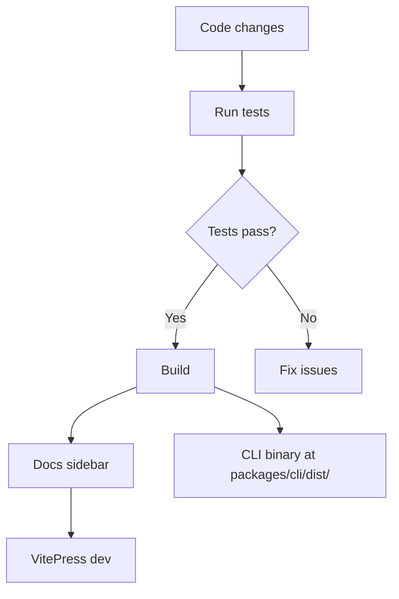

# Developer Setup

This guide covers how to set up the repository for local development, run tests and builds, work with the VitePress-based docs site during development, contribute changes, and run the CLI from source. It also explains the most relevant npm scripts defined at the repo root and in the CLI package.

## Repository Layout

- **Root**
    - `package.json`: workspace-level scripts (build, test, docs, etc.)
    - `pnpm-workspace.yaml`: defines the workspace layout
    - `docs/`: VitePress site for documentation
    - `docs/scripts/generateSidebar.ts`: script that auto-generates the VitePress sidebar
    - `developer/dev-setup.md`: this guide
- **packages/**
    - `cli/`: The Sintesi CLI (TypeScript, Vitest tests)
    - `core/`: Core tooling (native bindings and related code)
- **crates/**
    - `core/`: Rust bindings and platform-specific native npm packages
    - `core/npm/`: Platform-specific npm packages (e.g., linux-x64-gnu, win32-x64-msvc)
- **docs/scripts/**: Sidebar generation tooling
- **vitest.config.ts**: testing configurations

> **Note**: The repository uses a PNPM workspace configured in `pnpm-workspace.yaml` to manage multiple packages in a single repository.

**Repository URL**: [https://github.com/doctypedev/sintesi.git](https://github.com/doctypedev/sintesi.git)

---

## Prerequisites

- **Node.js**: v20.x or newer
- **PNPM**: v8 or newer
- **Rust Toolchain** (Optional): For building native crates locally.

---

## Local Development Workflow

### 1. Install Dependencies

From the repository root:

```bash
pnpm install
```

### 2. Run Tests

Run tests for all workspace packages:

```bash
pnpm test
```

> **Tip**: To run tests for a specific package, use filtering:
> `pnpm --filter @sintesi/sintesi test`

### 3. Build Locally

Recursive build across the workspace:

```bash
pnpm build
```

On success, it prints:
`✅ Build Completed. Run: <path>/packages/cli/dist/cli/src/index.js`

### 4. Lint and Format

```bash
pnpm lint
pnpm format
pnpm format:check
```

### 5. Prepare Changes and Release

Use `@changesets/cli` workflows:

```bash
pnpm changeset  # Create a changeset
pnpm release    # Version and publish
```

---

## Working with the Docs Site

The documentation site is built with VitePress.

### Development Server

```bash
pnpm run docs:dev
```

Generates the sidebar and launches the dev server.

### Production Build and Preview

```bash
pnpm run docs:build
pnpm run docs:preview
```

### Sidebar Generation

```bash
pnpm run generate:sidebar
```

Runs `docs/scripts/generateSidebar.ts` to update `docs/.vitepress/sidebar-auto.ts`.

---

## Running the CLI from Source

After building, you can run the built CLI binary directly:

```bash
node packages/cli/dist/cli/src/index.js <command> [options]
```

**Examples**:

```bash
node packages/cli/dist/cli/src/index.js readme --output README.md --force
node packages/cli/dist/cli/src/index.js documentation --output-dir docs --force
```

**Watch Mode** (for rapid iteration):

```bash
pnpm --filter @sintesi/sintesi run dev
```

---

## Contributing Guidelines

- **Standards**: Follow modern JS/TS practices. Run `pnpm lint` and `pnpm format` before submitting.
- **Tests**: Add tests under package `__tests__` folders. Verify with `pnpm test`.
- **Changesets**: Use `pnpm changeset` for user-facing changes.
- **Docs**: Update docs as code evolves. Run `pnpm run generate:sidebar` if structure changes.
- **Hooks**: Husky runs formatting on staged files.

---

## NPM Scripts

### Root `package.json`

| Script             | Description                                       |
| :----------------- | :------------------------------------------------ |
| `build`            | Builds all workspace packages recursively.        |
| `test`             | Runs tests for all workspace packages.            |
| `lint`             | Lints all workspace packages.                     |
| `clean`            | Cleans the workspace (removes dist folders).      |
| `release`          | Creates and publishes changesets.                 |
| `generate:sidebar` | Generates the documentation sidebar file.         |
| `docs:dev`         | Dev server for docs with auto sidebar generation. |
| `docs:build`       | Production build for docs.                        |
| `docs:preview`     | Preview production build locally.                 |
| `format`           | Formats code with Prettier.                       |
| `prepare`          | Initialize Husky hooks.                           |

### `packages/cli/package.json`

| Script  | Description                              |
| :------ | :--------------------------------------- |
| `build` | Compiles CLI TypeScript sources to dist. |
| `dev`   | TS build in watch mode.                  |
| `test`  | Runs Vitest tests for the CLI.           |
| `lint`  | Lints the CLI codebase.                  |

---

## Quick Dev Workflow Overview


