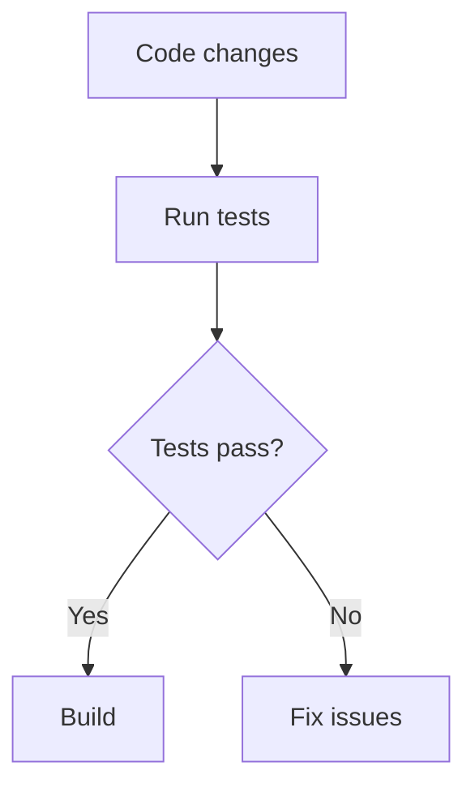
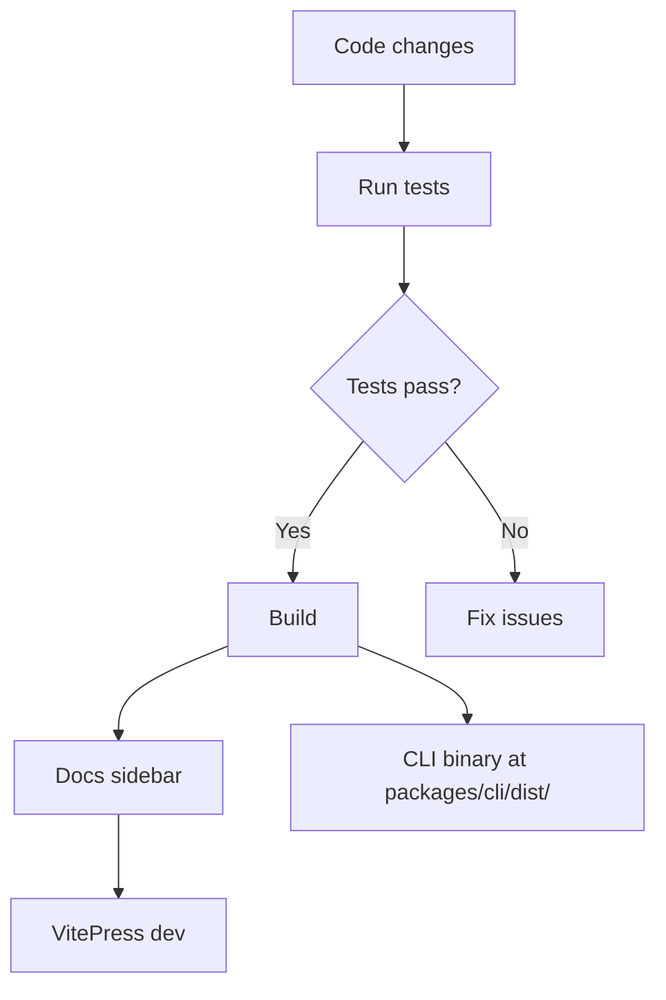

# Developer Setup

This guide covers how to set up the repository for local development, run tests and builds, work with the VitePress-based docs site during development, contribute changes, and run the CLI from source. It also explains the most relevant npm scripts defined at the repo root and in the CLI package.

## Repository Layout

- **Root**
    - `package.json`: workspace-level scripts (build, test, docs, etc.)
    - `pnpm-workspace.yaml`: defines the workspace layout
    - `docs/`: VitePress site for documentation
    - `docs/scripts/generateSidebar.ts`: script that auto-generates the VitePress sidebar
    - `developer/dev-setup.md`: this guide
- **packages/**
    - `cli/`: The Sintesi CLI (TypeScript, Vitest tests)
    - `core/`: Core tooling (native bindings and related code)
- **crates/**
    - `core/`: Rust bindings and platform-specific native npm packages
    - `core/npm/`: Platform-specific npm packages (e.g., linux-x64-gnu, win32-x64-msvc)
- **docs/scripts/**: Sidebar generation tooling
- **vitest.config.ts**: testing configurations

> **Note**: The repository uses a PNPM workspace configured in `pnpm-workspace.yaml` to manage multiple packages in a single repository. The workspace now explicitly includes the Rust crate and its platform packages (`crates/core` and `crates/core/npm/*`), so pnpm will consider them during installs/builds.

Important lineage files: the repository lineage used for docs/state tracking now includes `pnpm-workspace.yaml` as well as `packages/cli/package.json` and `packages/cli/tsconfig.json`. Changes to those files can affect build ordering, docs generation, or the automated dependency detection used by the tooling.

**Repository URL**: [https://github.com/doctypedev/sintesi.git](https://github.com/doctypedev/sintesi.git)

---

## Prerequisites

- **Node.js**: Node.js v20 or newer. The CLI package requires Node >= 20.0.0 (see `packages/cli/package.json` "engines" field). Ensure your local Node runtime matches or exceeds that requirement. If your environment needs a different Node version, update the package "engines" fields and CI configs consistently.
- **PNPM**: v8 or newer
- **Rust Toolchain** (Optional / Recommended): For building native crates locally (used to generate the .node binaries and TypeScript type declarations).

---

## Local Development Workflow

### 1. Install Dependencies

From the repository root:

```bash
pnpm install
```

Note: `pnpm install` will include workspace entries declared in `pnpm-workspace.yaml`, including `crates/core` and `crates/core/npm/*`.

### 2. Run Tests

Run tests for all workspace packages:

```bash
pnpm test
```

> **Tip**: To run tests for a specific package, use filtering:
> `pnpm --filter @sintesi/sintesi test`

### 3. Build Locally

Recursive build across the workspace:

```bash
pnpm build
```

On success, it prints:
`✅ Build Completed. Run: <path>/packages/cli/dist/cli/src/index.js`

### 3.a Native Rust core (crates/core) — local build

When you are developing or changing Rust code in `crates/core`, you must build the Rust crate locally to generate both the native Node addon (.node) and the TypeScript declaration file (`index.d.ts`) consumed by the TypeScript packages.

From the repository root, the equivalent of what CI now runs (the Smart Rust Build action) is:

```bash
# Build the Rust crate for your platform
cd crates/core
pnpm install
pnpm run build
cd ../..
```

After the build completes, locate the generated TypeScript declaration file produced by the Rust build. The exact location of `index.d.ts` can vary depending on the crate build packaging (for example, it may be emitted at `crates/core/index.d.ts`, `crates/core/pkg/index.d.ts`, or under a `target` or `dist` subfolder). Use the following robust approach from the repository root to find and copy the first matching declaration into the TypeScript package:

```bash
# Find a generated index.d.ts under crates/core (search depth will find common locations)
GENERATED=$(find crates/core -type f -name 'index.d.ts' | head -n 1)

if [ -z "$GENERATED" ]; then
  echo "index.d.ts could not be found under crates/core. Check build logs or crate packaging scripts (look under crates/core/pkg, crates/core/target, or similar)."
  exit 1
fi

# Ensure destination package folder exists and copy the types
mkdir -p packages/core
cp "$GENERATED" packages/core/native-types.d.ts

echo "Copied $GENERATED -> packages/core/native-types.d.ts"
```

If you know the exact path the build emits (for example `crates/core/pkg/index.d.ts`), you can copy it directly:

```bash
cp crates/core/pkg/index.d.ts packages/core/native-types.d.ts
```

Alternatively, `crates/core` contains helper scripts referenced in its README (for example `crates/core/scripts/build.sh`) — run those if present to package platform artifacts and copy types into place.

<Callout type="info">
If you modify Rust code and plan to build TypeScript packages (like `packages/core`), regenerate the TypeScript declaration file from `crates/core` and copy it to `packages/core/native-types.d.ts`. The CI Smart Rust Build action does this automatically; for local development, verify the generated path (see the find-based example above) and ensure the destination directory (`packages/core`) exists before copying. Also ensure the platform `.node` binary is available under `crates/core/npm/{platform}` if you need to run local Node tests that import the native module.
</Callout>

To test the built native package locally you can run the example included in the crate:

```bash
# After building the crate and ensuring platform package includes the .node binary
node crates/core/example.js
```

Expected behavior: the example attempts to require the platform package under `crates/core/npm/{platform}` (for example, `./npm/darwin-arm64`) and invoke exported functions/classes.

### 4. Lint and Format

```bash
pnpm lint
pnpm format
pnpm format:check
```

### 5. Prepare Changes and Release

Use `@changesets/cli` workflows:

```bash
pnpm changeset  # Create a changeset
pnpm release    # Version and publish
```

---

## Working with the Docs Site

The documentation site is built with VitePress. The repository includes a script to auto-generate a unified sidebar (`docs/scripts/generateSidebar.ts`) and a VitePress configuration at `docs/.vitepress/config.mts`.

Important: the repository's root docs scripts already call the sidebar generator before starting or building the site; you normally don't need to run it manually when using the provided scripts.

### Development Server

```bash
pnpm run docs:dev
```

This runs `pnpm run generate:sidebar` and launches the VitePress development server.

### Production Build and Preview

```bash
pnpm run docs:build
pnpm run docs:preview
```

Both commands run the sidebar generator first, then build/preview the site.

### Sidebar Generation

```bash
pnpm run generate:sidebar
```

Runs `docs/scripts/generateSidebar.ts` to update `docs/.vitepress/sidebar-auto.ts`. Run this manually if you add or reorganize markdown files and want to regenerate the sidebar without starting the dev server.

### Mermaid support (new)

The VitePress configuration now includes the vitepress-plugin-mermaid plugin and a mermaid configuration block. Relevant changes are in `docs/.vitepress/config.mts`:

- The config is wrapped with `withMermaid(defineConfig(...))` (imported from `vitepress-plugin-mermaid`).
- `vite.optimizeDeps.include` includes `['mermaid']` for faster dev startup.
- A `mermaid: { ... }` configuration object is present in the config file; use it to pass Mermaid API defaults.

DevDependencies include `mermaid` and `vitepress-plugin-mermaid` so diagrams render locally once dependencies are installed.

How to author Mermaid diagrams in docs:

- Use a fenced code block with the language set to `mermaid`.
- Example:



Troubleshooting notes:

- After changing the VitePress config or the `mermaid` config, restart the dev server (`pnpm run docs:dev`).
- If diagrams do not render, ensure dependencies are installed (`pnpm install`) and that the dev server was restarted after the install.

---

## Running the CLI from Source

After building, you can run the built CLI binary directly:

```bash
node packages/cli/dist/cli/src/index.js <command> [options]
```

**Examples**:

```bash
node packages/cli/dist/cli/src/index.js readme --output README.md --force
node packages/cli/dist/cli/src/index.js documentation --output-dir docs --force
```

**Watch Mode** (for rapid iteration):

```bash
pnpm --filter @sintesi/sintesi run dev
```

---

## Contributing Guidelines

- **Standards**: Follow modern JS/TS practices. Run `pnpm lint` and `pnpm format` before submitting.
- **Tests**: Add tests under package `__tests__` folders. Verify with `pnpm test`.
- **Changesets**: Use `pnpm changeset` for user-facing changes.
- **Docs**: Update docs as code evolves. Run `pnpm run generate:sidebar` if structure changes.
- **Hooks**: Husky runs formatting on staged files.

---

## NPM Scripts

### Root `package.json`

| Script             | Description                                       |
| :----------------- | :------------------------------------------------ |
| `build`            | Builds all workspace packages recursively.        |
| `test`             | Runs tests for all workspace packages.            |
| `lint`             | Lints all workspace packages.                     |
| `clean`            | Cleans the workspace (removes dist folders).      |
| `release`          | Creates and publishes changesets.                 |
| `generate:sidebar` | Generates the documentation sidebar file.         |
| `docs:dev`         | Dev server for docs with auto sidebar generation. |
| `docs:build`       | Production build for docs.                        |
| `docs:preview`     | Preview production build locally.                 |
| `format`           | Formats code with Prettier.                       |
| `prepare`          | Initialize Husky hooks.                           |

### `packages/cli/package.json`

| Script  | Description                              |
| :------ | :--------------------------------------- |
| `build` | Compiles CLI TypeScript sources to dist. |
| `dev`   | TS build in watch mode.                  |
| `test`  | Runs Vitest tests for the CLI.           |
| `lint`  | Lints the CLI codebase.                  |

---

## Quick Dev Workflow Overview



---
