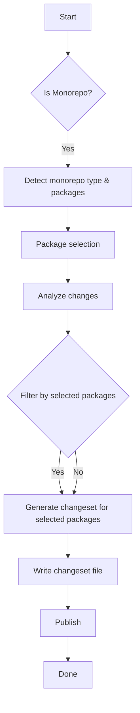

# Changeset Workflow with Sintesi

This guide explains how to use the `changeset` command to detect impacted packages, generate changesets, and publish updates in the Sintesi monorepo. It covers monorepo detection, filtering changes to relevant packages, and the publish flow.

::: info Note
The CLI includes a built-in check to ensure `@changesets/cli` is installed. If it is missing, you will see a clear error with installation instructions.
:::

## Overview

- **Detect** impacted packages in a (pnpm) monorepo.
- **Analyze** code changes using the ChangeAnalysisService which combines git diffs (Rust GitBinding) with AST symbol extraction and selective package.json summarization to produce focused, package-targeted insights. The ChangeAnalysisService performs the package.json summarization internally (it exposes options such as `includeSymbols` and `symbolChanges`) and ties the summaries to the currently selected package(s) so the AI/detector only receives the relevant package metadata.
- **Generate** a changeset file in `.changeset` (the generator uses AI by default, with deterministic heuristics as a fallback, or manual inputs).
- **Publish** or bump versions using Changesets.

## How the Changeset Flow Works

1.  **Detection**: Checks for monorepo structure and packages.
2.  **Selection**: Selects target packages (manual or interactive).
3.  **Analysis**: Uses ChangeAnalysisService to compute a git diff (leveraging a Rust-based GitBinding implementation) and perform AST-level symbol extraction. ChangeAnalysisService also summarizes only the package.json entries relevant to the selected package(s) — this summarization is done inside the service (using configuration options like `includeSymbols` and `symbolChanges`) so downstream AI/detectors receive a concise, per-package view of metadata and changed symbols.
4.  **Generation**: Writes a changeset file with frontmatter listing affected packages and version bump.
5.  **Publishing**: Use standard Changesets workflows or the repo's release script.



## Prerequisites

- A pnpm-based workspace or supported monorepo layout.
- `@changesets/cli` installed in the project.

---

## Step-by-Step Workflow

### 1. Detect Impacted Packages

The command detects the monorepo structure via `MonorepoDetector`. If multiple packages exist, you can select which ones to include.

### 2. Analyze Changes

Analyzes changes against `baseBranch` (default `main`) using the ChangeAnalysisService. In a monorepo, analysis is limited to files affecting the selected packages; the service merges precise git diffs (via the Rust GitBinding) with AST-level symbol changes and internally summarizes only the package.json metadata relevant to the selected packages. This focused context reduces noise and yields more targeted changeset suggestions from the AI or the automatic detector.

### 3. Generate a Changeset

Determines version type and description via:

- **Manual**: User provided.
- **AI-enabled (default)**: AI analyzes impact and suggests version bump and description.
- **Auto-detect (fallback)**: If AI is skipped (via `--skip-ai`) or fails, the generator falls back to deterministic auto-detection heuristics. Manual overrides are also accepted via CLI flags.

A changeset file is written to `.changeset` (e.g., `"package-name": "minor"`).

### 4. Publish

Publish via standard Changesets workflow:

```bash
pnpm changeset version
pnpm changeset publish
```

Or use the release script:

```bash
pnpm release
```

---

## CLI Options

| Flag             | Alias | Description                         | Default       |
| :--------------- | :---- | :---------------------------------- | :------------ |
| `--base-branch`  | `-b`  | Base branch to compare against      | `main`        |
| `--staged-only`  | `-s`  | Only analyze staged changes         | `false`       |
| `--package-name` | `-p`  | Package name(s) for the changeset   | `['package']` |
| `--output-dir`   | `-o`  | Output directory                    | `.changeset`  |
| `--skip-ai`      |       | Skip AI analysis (use defaults)     | `false`       |
| `--version-type` | `-t`  | Manually specify version type       |               |
| `--description`  | `-d`  | Manually specify description        |               |
| `--verbose`      |       | Enable verbose logging              | `false`       |
| `--interactive`  | `-i`  | Force interactive package selection | `false`       |
| `--force-fetch`  |       | Fetch latest changes from remote    | `false`       |

---

## Usage Examples

**AI-Assisted Generation** (Default)

```bash
sintesi changeset
```

**Staged Changes Only** (No Fetch)

```bash
sintesi changeset --base-branch main --staged-only --skip-ai
```

**Force Fetch & Analyze Staged**

```bash
sintesi changeset --base-branch main --force-fetch --staged-only
```

**Manual Package & Description (single package using short flag)**

```bash
sintesi changeset -p @sintesi/sintesi-core -t minor -d "Add new feature X"
```

**Target Multiple Packages**

```bash
sintesi changeset -p @sintesi/pkg-a -p @sintesi/pkg-b
```

**Skip AI (Manual Fallback)**

```bash
sintesi changeset --skip-ai -t patch -d "Bug fix in parser"
```

**Single Package Mode (explicit long flag)**

```bash
sintesi changeset --package-name @sintesi/sintesi-core --output-dir ".changeset"
```

---

## Publishing Flow

1.  **Verify**: Ensure `.changeset/` contains new files.
2.  **Version**:
    ```bash
    pnpm changeset version
    ```
3.  **Publish**:
    ```bash
    pnpm changeset publish
    ```
    _(Or use `pnpm release`)_

---

## Troubleshooting

| Issue           | Resolution                                                                                                                                                                                                           |
| :-------------- | :------------------------------------------------------------------------------------------------------------------------------------------------------------------------------------------------------------------- |
| **Missing CLI** | Install `@changesets/cli` locally (`pnpm add -D @changesets/cli`).                                                                                                                                                   |
| **No Changes**  | Review `baseBranch` and ensure meaningful changes exist in selected packages.                                                                                                                                        |
| **AI Failures** | If AI fails during generation, the generator will attempt deterministic auto-detection as a fallback. To force deterministic/manual behavior use `--skip-ai` and provide `--version-type`/`--description` if needed. |

## AI Integration

The implementation uses a robust `parseAIResponse` function to extract `versionType` (major/minor/patch) and `description`. ChangeAnalysisService supplies a concise, per-package context — combining Rust GitBinding diffs, AST symbol extraction, and package.json summarization performed by the service itself (configured via options like `includeSymbols` and `symbolChanges`). AI is used by default to suggest version bumps and descriptions; if AI is skipped (`--skip-ai`) or the AI step fails, the generator falls back to deterministic auto-detection heuristics, and manual CLI inputs always override generated values.
