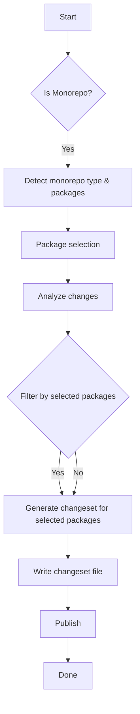

# Changeset Workflow with Sintesi

This guide explains how to use the `changeset` command to detect impacted packages, generate changesets, and publish updates in the Sintesi monorepo. It covers monorepo detection, filtering changes to relevant packages, and the publish flow.

::: info Note
The CLI includes a built-in check to ensure `@changesets/cli` is installed. If it is missing, you will see a clear error with installation instructions.
:::

## Overview

- **Detect** impacted packages in a (pnpm) monorepo.
- **Analyze** code changes and symbol-level changes.
- **Generate** a changeset file in `.changeset`.
- **Publish** or bump versions using Changesets.

## How the Changeset Flow Works

1.  **Detection**: Checks for monorepo structure and packages.
2.  **Selection**: Selects target packages (manual or interactive).
3.  **Analysis**: Analyzes code changes against the base branch (default `main`).
4.  **Generation**: Writes a changeset file with frontmatter listing affected packages and version bump.
5.  **Publishing**: Use standard Changesets workflows or the repo's release script.



## Prerequisites

- A pnpm-based workspace or supported monorepo layout.
- `@changesets/cli` installed in the project.

---

## Step-by-Step Workflow

### 1. Detect Impacted Packages

The command detects the monorepo structure via `MonorepoDetector`. If multiple packages exist, you can select which ones to include.

### 2. Analyze Changes

Analyzes changes against `baseBranch` (default `main`). In a monorepo, it filters analysis to only include changes affecting selected packages.

### 3. Generate a Changeset

Determines version type and description via:

- **Manual**: User provided.
- **AI-enabled**: AI analyzes impact.
- **Auto-detect**: Infers version type if AI is skipped.

A changeset file is written to `.changeset` (e.g., `"package-name": "minor"`).

### 4. Publish

Publish via standard Changesets workflow:

```bash
pnpm changeset version
pnpm changeset publish
```

Or use the release script:

```bash
pnpm release
```

---

## CLI Options

| Flag             | Alias | Description                         | Default       |
| :--------------- | :---- | :---------------------------------- | :------------ |
| `--base-branch`  | `-b`  | Base branch to compare against      | `main`        |
| `--staged-only`  | `-s`  | Only analyze staged changes         | `false`       |
| `--package-name` | `-p`  | Package name(s) for the changeset   | `['package']` |
| `--output-dir`   | `-o`  | Output directory                    | `.changeset`  |
| `--skip-ai`      |       | Skip AI analysis (use defaults)     | `false`       |
| `--version-type` | `-t`  | Manually specify version type       |               |
| `--description`  | `-d`  | Manually specify description        |               |
| `--verbose`      |       | Enable verbose logging              | `false`       |
| `--interactive`  | `-i`  | Force interactive package selection | `false`       |
| `--force-fetch`  |       | Fetch latest changes from remote    | `false`       |

---

## Usage Examples

**AI-Assisted Generation** (Default)

```bash
sintesi changeset
```

**Staged Changes Only** (No Fetch)

```bash
sintesi changeset --base-branch main --staged-only --skip-ai
```

**Force Fetch & Analyze Staged**

```bash
sintesi changeset --base-branch main --force-fetch --staged-only
```

**Manual Package & Description**

```bash
sintesi changeset -p @sintesi/sintesi-core -t minor -d "Add new feature X"
```

**Skip AI (Manual Fallback)**

```bash
sintesi changeset --skip-ai -t patch -d "Bug fix in parser"
```

**Single Package Mode**

```bash
sintesi changeset --package-name @sintesi/sintesi-core --output-dir ".changeset"
```

---

## Publishing Flow

1.  **Verify**: Ensure `.changeset/` contains new files.
2.  **Version**:
    ```bash
    pnpm changeset version
    ```
3.  **Publish**:
    ```bash
    pnpm changeset publish
    ```
    _(Or use `pnpm release`)_

---

## Troubleshooting

| Issue           | Resolution                                                                    |
| :-------------- | :---------------------------------------------------------------------------- |
| **Missing CLI** | Install `@changesets/cli` locally (`pnpm add -D @changesets/cli`).            |
| **No Changes**  | Review `baseBranch` and ensure meaningful changes exist in selected packages. |
| **AI Failures** | Use `--skip-ai` to fall back to auto-detection or provide manual values.      |

## AI Integration

The implementation uses a robust `parseAIResponse` function to extract `versionType` (major/minor/patch) and `description`. If AI fails or is skipped, it falls back to manual/auto-detected values.
