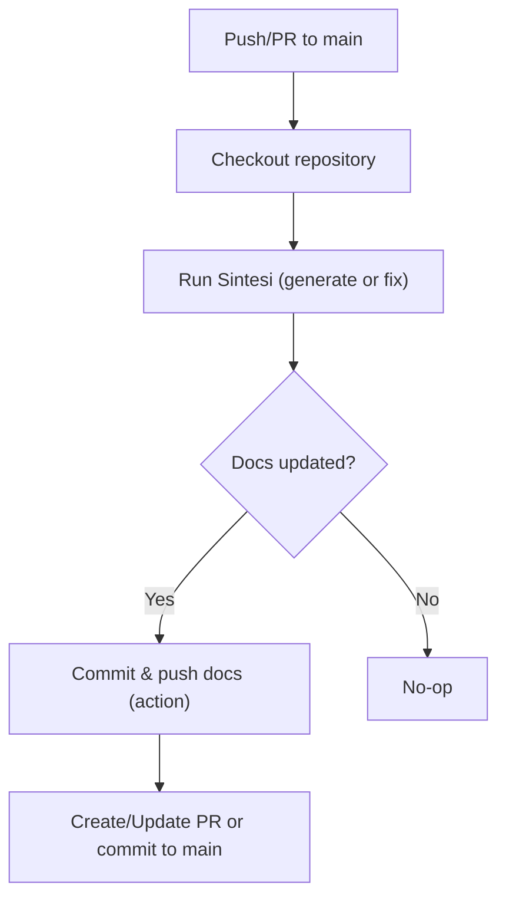
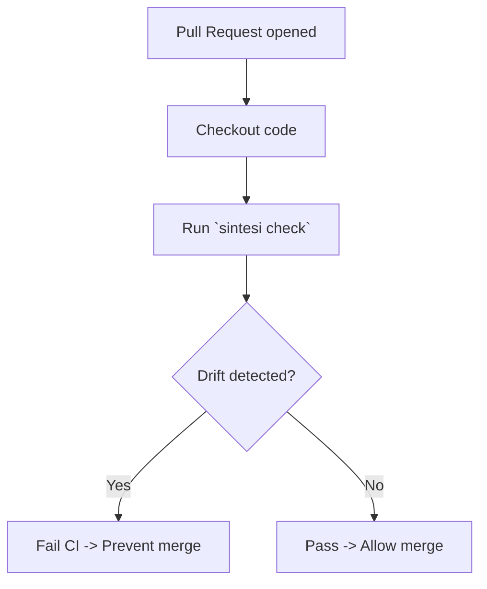

## Overview

This guide describes recommended Continuous Integration (CI) flows for using Sintesi to generate and enforce documentation. It includes example GitHub Actions workflows and key operational notes you must follow in CI:

- Use the CLI commands documented here (`sintesi documentation`, `sintesi readme`, `sintesi check`) or the official GitHub Action `doctypedev/action@v0`.
- Ensure required environment variables (notably `OPENAI_API_KEY`) are present.
- Prefer incremental indexing and concurrency-safe runs (see the Safe Indexing & Concurrency section).

<Callout type="info">
Sintesi detects documentation drift and returns a non-zero exit code when documentation is out-of-sync. Use `--no-strict` to make `sintesi check` non-blocking in CI.
</Callout>

## Recommended Flows

### 1) Documentation Generation (automated sync)

Use this flow to generate or update a documentation site (or README) automatically on `main` or on a scheduled job. Prefer using the official action for simpler secret wiring.

Mermaid flow:



- If you use the `--force` flag, Sintesi will regenerate docs from scratch and ignore existing markdown/state.
- Sintesi supports incremental indexing (it persists the last-processed commit SHA for efficient runs).

Add a new workflow in `.github/workflows/sintesi.yml`:

Example (GitHub Actions using the official action):

```yaml
name: Sintesi
on:
    push:
        branches: [main]

concurrency:
    group: ${{ github.workflow }}-${{ github.ref }}
    cancel-in-progress: true

permissions:
    contents: write
    pull-requests: write

jobs:
    generate-docs:
        runs-on: ubuntu-latest
        steps:
            - uses: actions/checkout@v4
              with:
                  fetch-depth: 0

            - name: Sintesi Check & Fix
              uses: doctypedev/action@v0
              with:
                  openai_api_key: ${{ secrets.OPENAI_API_KEY }}
                  cohere_api_key: ${{ secrets.COHERE_API_KEY }}
                  github_token: ${{ secrets.GITHUB_TOKEN }}
                  targets: 'readme,docs'
                  docs_output: 'docs'
```

### 2) Check & Enforcement (block merges when docs drift)

Use this flow to enforce that documentation is in sync with source changes. The job runs `sintesi check` and fails the CI pipeline when drift is detected.

Mermaid flow:



Minimal, CLI-based GitHub Actions job:

```yaml
name: 'Docs Drift Check'
on:
    pull_request:

jobs:
    check-docs:
        runs-on: ubuntu-latest
        steps:
            - uses: actions/checkout@v4
              with:
                  fetch-depth: 0

            - name: Install Sintesi CLI
              run: npm install -g @sintesi/sintesi

            - name: Check documentation drift
              run: sintesi check
              env:
                  OPENAI_API_KEY: ${{ secrets.OPENAI_API_KEY }}
                  COHERE_API_KEY: ${{ secrets.COHERE_API_KEY }}
```

Important: default baseline used by `sintesi check`

- By default, `sintesi check` uses the Lineage SHA recorded in .sintesi/lineage.json as the baseline commit to compare against. This is the typical CI baseline to detect drift from the last indexed commit.
- To override the baseline, pass `--base <ref-or-sha>`. Examples:
    - `sintesi check --base origin/main`
    - `sintesi check --base HEAD~1`
    - `sintesi check --base 4f7a2b3` (explicit commit SHA)

If you need non-blocking checks, add `--no-strict`:

```bash
sintesi check --no-strict
```

You can scope checks to README or docs individually:

```bash
sintesi check --readme
sintesi check --doc
```

## CLI Flags Reference

| Flag          | Description                                                                        |
| ------------- | ---------------------------------------------------------------------------------- |
| `--force`     | Force full regeneration, ignoring previous state and existing docs.                |
| `--no-strict` | Run `sintesi check` in non-blocking mode (returns zero even when drift detected).  |
| `--readme`    | Scope `sintesi check` to the README only.                                          |
| `--doc`       | Scope `sintesi check` to the documentation site only.                              |
| `--base`      | Override the default baseline used by `sintesi check` (accepts commit SHA or ref). |

## Action Inputs (official action)

| Input            | Required | Description                                            |
| ---------------- | -------- | ------------------------------------------------------ |
| `openai_api_key` | yes      | OpenAI key used for AI agents.                         |
| `cohere_api_key` | no       | Cohere API key for semantic retrieval / reranking.     |
| `github_token`   | yes      | Token to push commits or open PRs.                     |
| `targets`        | no       | Comma-separated targets, e.g., `readme,docs`.          |
| `docs_output`    | no       | Output directory for generated docs (default: `docs`). |

## Environment Variables

| Name               | Required | Purpose                                                |
| ------------------ | -------- | ------------------------------------------------------ |
| `OPENAI_API_KEY`   | yes      | Required for AI-powered generation.                    |
| `COHERE_API_KEY`   | no       | Optional: improves semantic retrieval/reranking (RAG). |
| `HELICONE_API_KEY` | no       | Optional: AI observability and cost tracking.          |

## Safe Indexing & Concurrency Notes

Sintesi includes several safeguards for CI environments:

- Incremental indexing: Sintesi persists the last-processed commit SHA to speed up subsequent runs and avoid reprocessing unchanged files. This reduces cost and latency in CI (improved in 0.20.0).
- Force mode: Running `sintesi documentation --force` disables incremental checks and existing-doc scans. Use it only when you intentionally want a full regeneration.
- Thread-safe writes: Sintesi uses progressive saving and thread-safe file writing to avoid corruption during concurrent operations.
- CI concurrency: Configure your CI to avoid overlapping runs for the same branch. For GitHub Actions, use a `concurrency` group with `cancel-in-progress: true` (example provided above). This prevents race conditions where multiple jobs attempt to write docs simultaneously.
- Use full checkout (`fetch-depth: 0`) so Sintesi can compute diffs based on real commit history.

CI caching: exclude .sintesi state files

- Do not cache ephemeral Sintesi state files (they can cause inconsistent behavior when restored across different runs). Exclude `.sintesi/*.state.json` from any CI cache. Preferred approaches:
    - Do not include the .sintesi directory in cache paths.
    - If you must cache parts of `.sintesi`, explicitly delete state files at the start (or before saving) of the job so they are not reused or saved into the cache.
- GitHub Actions examples:

Avoid caching `.sintesi` entirely:

```yaml
- name: Restore cache (example)
  uses: actions/cache@v4
  with:
      path: |
          node_modules
          .cache
      key: ${{ runner.os }}-node-${{ hashFiles('**/package-lock.json') }}
```

If your workflow or cache setup would otherwise capture the repository workspace, prune state files early in the job:

```yaml
- name: Prune Sintesi state files (avoid caching or using stale state)
  run: |
      if [ -d .sintesi ]; then
        find .sintesi -type f -name "*.state.json" -print -delete || true
      fi
```

Place the prune step before any cache-save or restore logic that might include workspace files, and/or before running Sintesi, so runs use fresh indexing state and CI caches do not store `.state.json` artifacts.

<Callout type="warning">
Do not run multiple concurrent jobs that write to the same documentation output directory for the same branch unless you have orchestration to serialize them. Prefer cancel-in-progress or a single scheduled job per branch.
</Callout>

## Best Practices

- Always run `actions/checkout` with `fetch-depth: 0` in workflows that use Sintesi so the CLI can compute diffs accurately.
- Provide `OPENAI_API_KEY` in repository secrets. If you use RAG features, include `COHERE_API_KEY`.
- Use the official action `doctypedev/action@v0` when you want a turnkey integration (it accepts `openai_api_key`, `cohere_api_key`, `targets`, `docs_output`).
- Reserve `--force` for manual or maintenance runs — it disables smart, incremental checks.
- When enforcing docs via `sintesi check`, prefer strict mode in protected branches (do not use `--no-strict`) and use `--no-strict` for optional CI lanes like nightly scans.
- Exclude `.sintesi/*.state.json` from CI caches (or delete them early in the job) to avoid restoring stale state across runs.
- By default `sintesi check` uses the Lineage SHA recorded in `.sintesi/lineage.json` as its baseline; use `--base` to override when needed.

## Example: Clone & Run Locally (CI-friendly)

If you prefer a job that clones the repository and runs the CLI directly:

```yaml
jobs:
    local-cli:
        runs-on: ubuntu-latest
        steps:
            - name: Clone repository
              run: git clone https://github.com/doctypedev/doctype.git .

            - name: Install dependencies & Sintesi
              run: |
                  npm ci
                  npm install -g @sintesi/sintesi

            - name: Run Sintesi check
              run: sintesi check
              env:
                  OPENAI_API_KEY: ${{ secrets.OPENAI_API_KEY }}
```

## Troubleshooting

- If the action or CLI cannot push updates, ensure `permissions.contents` and `permissions.pull-requests` are set appropriately (see examples).
- If runs are unexpectedly expensive or slow, confirm incremental indexing is working (Sintesi persists commit state) and that `fetch-depth` is not truncated.
- For regenerations that repeatedly trigger changes, try `sintesi documentation --force` locally to inspect the full output before applying to CI.
- If CI shows inconsistent results between runs, verify that `.sintesi/*.state.json` files are not being restored from caches or otherwise reused across unrelated runs.

## Links

- Repo to clone in CI examples: `https://github.com/doctypedev/doctype.git`
- CLI reference: https://sintesicli.dev/reference/commands.html

<Callout type="info">
Use the verified commands shown in this guide inside CI. Avoid running undocumented flags or workflows—Sintesi's behavior relies on the documented commands and flags above.
</Callout>
