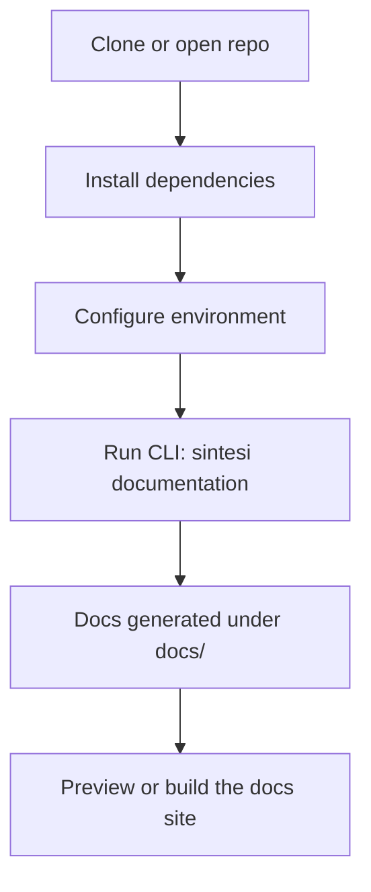

# Getting Started with Sintesi

Welcome to Sintesi. This quick-start guide walks you through installing the monorepo, configuring the environment, running the CLI, and performing a simple end-to-end example that generates documentation for a repository.



This guide assumes you’re working with the Sintesi monorepo root that uses pnpm workspaces. If you already have a Sintesi project, you can apply these steps to your repository to generate and maintain documentation with AI-assisted tooling.

---

## What You’ll Need

- **Node.js** (recommended: v18+)
- **pnpm** (as the workspace manager)
- **Access to AI services** via environment variables (OpenAI, Cohere, etc.)

**Repository URL**: [https://github.com/doctypedev/sintesi.git](https://github.com/doctypedev/sintesi.git)

> Note: The CLI in these examples uses OpenAI as the primary AI provider. Actual AI provider selection and usage depend on the environment variables you set (e.g., `OPENAI_API_KEY`, `COHERE_API_KEY`) and the active pipeline configured in your environment or deployment.

> The root monorepo uses a pnpm workspace configuration (`pnpm-workspace.yaml`) and exposes a CLI at `packages/cli`. The CLI commands are designed to verify, readme, document, and generate changesets with AI assistance.

---

## Prerequisites

- Ensure you have **Node.js** and **pnpm** installed.
- Confirm you’re at the repository root (where `pnpm-workspace.yaml` lives).

---

## Installation (pnpm workspace)

1.  **Install dependencies at the workspace root**

    From the repository root:

    ```bash
    pnpm install
    ```

2.  **Verify the CLI is available**

    You can install the CLI globally (recommended for CI or convenient local use):

    ```bash
    npm install -g sintesi-monorepo-root
    sintesi --version
    ```

    Or run it via `npx` without a global install:

    ```bash
    npx sintesi --version
    ```

    This should print a version like `0.1.0` (as defined in the CLI entry).

> **Tip**: In a pnpm workspace, you can also run scripts from the root without needing to install globally:
>
> - `pnpm run docs:dev`
> - `pnpm run docs:build`
> - `pnpm run docs:preview`

---

## Environment Configuration

The AI-powered features require API keys. Start by copying the example and filling in your keys.

1.  **Copy and edit**:

    ```bash
    cp .env.example .env
    ```

2.  **Required Values**:
    - `OPENAI_API_KEY`: Required for AI-powered documentation generation.

3.  **Optional Keys** (enable additional capabilities):
    - `COHERE_API_KEY`: For embeddings/RAG.
    - `HELICONE_API_KEY`: Optional, for observability and telemetry. Note: Helicone is available for optional observability; the CLI does not currently wire Helicone into the AI inference pipeline by default.
    - `GEMINI_API_KEY`: Optional, reserved for future integrations. Gemini is included in environment examples for potential future use but is not currently wired into the active AI pipeline.

**Example contents**:

```env
OPENAI_API_KEY=sk-your-openai-api-key-here
HELICONE_API_KEY=sk-helicone-your-api-key-here
COHERE_API_KEY=your-cohere-api-key-here
GEMINI_API_KEY=your-gemini-api-key-here
```

> **Important**: `OPENAI_API_KEY` is **REQUIRED** for AI-powered documentation generation. The other keys enable optional features like observability and semantic retrieval or are reserved for future integrations.

> **Safety Tip**: Keep `.env` private and do not commit it to version control.

---

## Running the CLI

Sintesi exposes several commands.

### Available Commands

- `check`: Verify documentation is in sync with code.
- `readme`: Generate a `README.md` based on project context.
- `documentation`: Generate comprehensive documentation site structure.
- `changeset`: Generate a changeset file from code changes using AI.

> Command-line flags and their names can change across releases; consult the official CLI reference for the authoritative, up-to-date list of options:  
> 👉 CLI Reference: https://sintesicli.dev/reference/commands.html

### Key Flags

#### `readme`

| Flag        | Alias | Description             | Default     |
| :---------- | :---- | :---------------------- | :---------- |
| `--output`  | `-o`  | Output file path        | `README.md` |
| `--force`   | `-f`  | Overwrite existing file |             |
| `--verbose` |       | Enable verbose logging  |             |

#### `documentation`

| Flag           | Alias | Description             | Default |
| :------------- | :---- | :---------------------- | :------ |
| `--output-dir` | `-o`  | Output directory        | `docs`  |
| `--force`      | `-f`  | Force full regeneration |         |
| `--verbose`    |       | Enable verbose logging  |         |

#### `check`

| Flag              | Alias   | Description                                        | Default |
| :---------------- | :------ | :------------------------------------------------- | :------ |
| `--verbose`       |         | Enable verbose logging                             |         |
| `--strict`        |         | Exit with error if drift detected (can be negated) | `true`  |
| `--smart`         |         | Use AI to detect high-level drift                  |         |
| `--base`          |         | Base branch for smart check                        |         |
| `--readme`        |         | Check only README drift                            |         |
| `--documentation` | `--doc` | Check only documentation drift (alias: `--doc`)    |         |
| `--output`        | `-o`    | Output file path for README check                  |         |
| `--output-dir`    | `-d`    | Output directory for documentation check           |         |

Note: The CLI uses yargs for flag parsing. `--strict` defaults to true; yargs supports negation, so you can pass `--no-strict` to disable strict behavior (useful in CI where you want a non-error exit code while still reporting drift).

#### `changeset`

| Flag             | Alias | Description                         |
| :--------------- | :---- | :---------------------------------- |
| `--base-branch`  | `-b`  | Base branch to compare against      |
| `--staged-only`  | `-s`  | Only analyze staged changes         |
| `--package-name` | `-p`  | Package name for the changeset      |
| `--output-dir`   | `-o`  | Output directory                    |
| `--skip-ai`      |       | Skip AI analysis                    |
| `--version-type` | `-t`  | `major` \| `minor` \| `patch`       |
| `--description`  | `-d`  | Manually specify description        |
| `--verbose`      |       | Enable verbose logging              |
| `--interactive`  | `-i`  | Force interactive package selection |
| `--force-fetch`  |       | Fetch latest changes from remote    |

### Usage Examples

Check for documentation drift with verbose and smart checks:

```bash
npx sintesi check --verbose --smart --base main
```

Check only documentation drift (two equivalent forms: long and alias):

```bash
npx sintesi check --documentation --base main
# or using the alias:
npx sintesi check --doc --base main
```

Generate a README for the current project:

```bash
npx sintesi readme
```

Generate a changeset from current changes:

```bash
npx sintesi changeset --base-branch main
```

Generate documentation for the project:

```bash
npx sintesi documentation
```

---

## End-to-End Example: Generate Docs for a Repository

**Goal**: From a fresh checkout, install, configure, and generate documentation for the repository, then preview the docs site locally.

### Step 1: Install Workspace Dependencies

From the repository root:

```bash
pnpm install
```

### Step 2: Configure Environment

Copy and populate the environment file:

```bash
cp .env.example .env
```

Fill in `OPENAI_API_KEY` (required) and other optional keys. Note that `HELICONE_API_KEY` and `GEMINI_API_KEY` are included for observability and potential future integrations; they are optional and are not currently wired into the active AI inference pipeline by default.

### Step 3: Generate Documentation

Generate the documentation site structure and content with AI planning:

```bash
npx sintesi documentation
```

This will analyze the project, plan the docs structure, and generate content in the `docs/` directory.

### Step 4: Preview Locally

Start the VitePress documentation site:

```bash
pnpm run docs:dev
```

Open [http://localhost:5173](http://localhost:5173) to view the generated docs.

### Optional Steps

- **Verify drift**:

    ```bash
    npx sintesi check
    # or scoped:
    npx sintesi check --readme
    ```

    If you run checks in CI and prefer not to fail the job on drift, you can disable strict mode. The `--strict` flag defaults to `true`; yargs supports negation, so use:

    ```bash
    npx sintesi check --no-strict
    ```

- **Force update README**:
    ```bash
    npx sintesi readme --force
    ```

---

## What to Expect

1.  The CLI processes the repository, detects monorepo structure or single-package layout, and uses AI to draft documentation content.
2.  Generated docs appear under the `docs` directory, ready for preview or further customization.
3.  You can continue iterating: adjust code, re-run documentation generation, and verify drift with the `check` command.

- The docs site supports Mermaid diagrams — you can include Mermaid blocks in docs pages.

## Next Steps

- Familiarize yourself with the CLI options to tailor the generation workflow to your project.
- Explore the generated docs structure in `docs/` and adjust as needed for your team's workflow.
- Integrate Sintesi into CI to ensure documentation stays in sync with code changes.
- For more on the system architecture and RAG, see:
    - Concepts — Architecture: https://sintesicli.dev/concepts/architecture.html
    - Concepts — RAG: https://sintesicli.dev/concepts/rag.html

::: info Note
This quick-start guide assumes a standard Sintesi monorepo setup using pnpm workspaces as defined in `pnpm-workspace.yaml` at the repository root. If your project uses a different workspace layout, adjust the commands accordingly (e.g., running from a subpackage directory or using `--filter` when invoking workspace scripts).
:::
