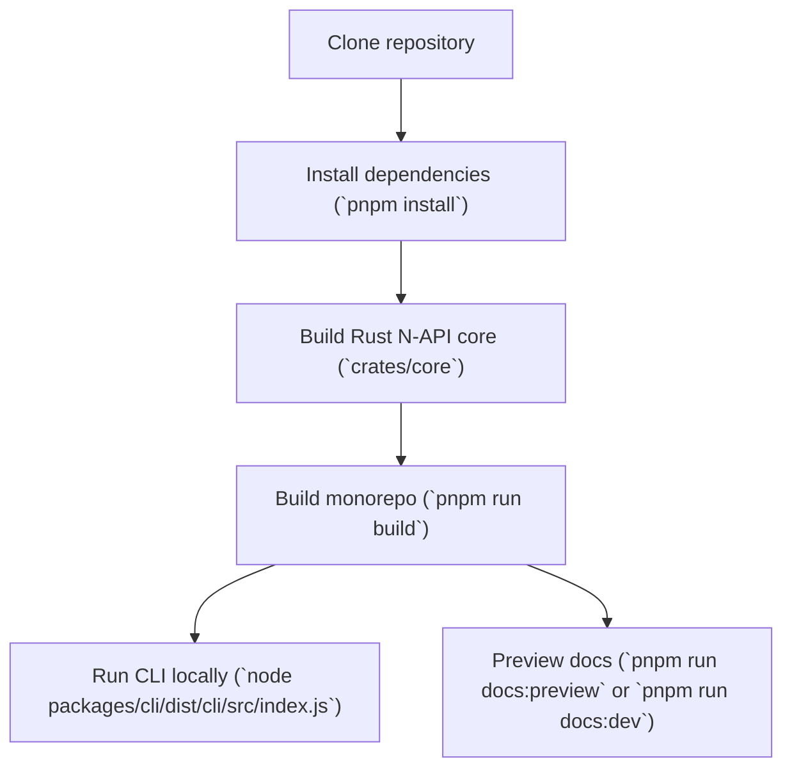

<Callout type="info">
This guide covers building and running the monorepo locally. The repository URL used in examples is `https://github.com/doctypedev/sintesi.git`. The CLI loads environment variables from a `.env` file (`packages/cli` uses `dotenv`), so create one if your workflows require API keys or other secrets.
</Callout>

## Overview

This document explains the minimal steps to:

1. Install `pnpm`.
2. Clone the repository.
3. Install workspace dependencies.
4. Build the Rust N‑API core (`crates/core`).
5. Build and run the `sintesi` CLI locally.
6. Start a VitePress preview of the docs.

A high-level flow is shown below.



## Prerequisites

Ensure you have these installed:

- `Node.js` (supported by the repo)
- `npm` (bundled with Node)
- Rust toolchain (`rustc`, `cargo`) for building the native core
- `pnpm` (the repo's `packageManager` is `pnpm@8.15.5`)

Important: the project pins pnpm to 8.15.5 (see `packageManager` and root scripts). To avoid CI drift, make sure automated environments (CI runners, GitHub Actions, etc.) use pnpm@8.15.5.

If you don't have `pnpm` installed, install the exact version used by the project:

```bash
# Option A: install via npm (global)
npm install -g pnpm@8.15.5

# Option B: use corepack (recommended in CI)
corepack enable
corepack prepare pnpm@8.15.5 --activate
```

## 1 — Clone the repository

```bash
git clone https://github.com/doctypedev/sintesi.git
cd sintesi
```

## 2 — Install workspace dependencies

At the repository root run:

```bash
pnpm install
```

This respects `pnpm-workspace.yaml` and installs dependencies for the root and workspace packages (including `packages/*` and `crates/core`).

## 3 — Build the Rust N‑API core

The Rust core provides native Node bindings living in `crates/core`. The repository's canonical and up-to-date build instructions live in `crates/core/README.md` — check that file first. Below are the common workflows you may encounter; pick the one that matches what the crate's README or package files describe.

A. If `crates/core` provides Node-level scripts (package.json with a `build` script)

- Verify by inspecting `crates/core/package.json` for a `scripts.build` entry.
- If present, run the crate's documented commands (use pnpm if the repo uses it):

```bash
cd crates/core
pnpm install        # or npm install if pnpm is not used for that crate
pnpm run build      # runs the crate's documented build/packaging steps
# or, for a debug build (if supported by the crate)
pnpm run build:debug
```

B. If the crate is built directly with Cargo (no package.json build script)

- Build the native library with Cargo and then run any repository-provided packaging helper (if present). The helper could live under `crates/core/scripts/` or be described in the crate README — follow that helper when available.

```bash
cd crates/core
cargo build --release

# If the repository includes a helper script to package/copy the produced native binary into
# the platform npm package, run it from the repo root. Examples (check which exists):
# ./crates/core/scripts/build.sh
# node ./crates/core/scripts/packageNative.js
# pnpm -w --filter ./crates/core run package
```

Notes:

- Always follow the steps described in `crates/core/README.md` when present — the crate may include packaging/copy steps specific to this repo.
- Building native addons requires a working Rust toolchain (`rustup`, `cargo`) and platform build tools (Xcode Command Line Tools on macOS, build-essential on Linux, Visual Studio Build Tools on Windows).
- The crate commonly places platform-specific artifacts into `crates/core/npm/` or into `crates/core/target/*`. If you run into a runtime "missing native binary" error, inspect those locations or re-run the crate packaging helper.

## 4 — Build the monorepo (TypeScript packages & CLI)

From the repository root you can build all packages:

```bash
pnpm run build
```

The root `build` script runs the workspace build (`pnpm -r build`). On success it prints a helpful path to the built CLI:

```
✅ Build Completed. Run: $(pwd)/packages/cli/dist/cli/src/index.js
```

If you prefer to build only the CLI package (when a package-level `build` script exists), use a recursive or filtered build:

```bash
# run build for all packages that define it
pnpm -r build

# or run build only for the CLI package (if you prefer)
pnpm -w --filter ./packages/cli run build
```

## 5 — Run the CLI locally

Install the published CLI globally (optional — useful for CI or quick local usage):

```bash
npm install -g @sintesi/sintesi
```

After a successful build the CLI entrypoint is available as JavaScript under `packages/cli/dist/cli/src/index.js` (the `dist` tree is generated by the package build — typically TypeScript -> JS transpilation and bundling). You can run it directly with Node:

```bash
# run help
node packages/cli/dist/cli/src/index.js --help

# run a command, for example the README generator
node packages/cli/dist/cli/src/index.js readme --output README.generated.md --force

# run the documentation command (example)
node packages/cli/dist/cli/src/index.js documentation --output-dir docs/generated --force
```

Alternative local invocation methods:

- If the CLI package defines a bin in `packages/cli/package.json`, you can execute it via pnpm exec without referencing the dist path explicitly:

```bash
# run the package's declared binary (if the package exposes "bin": { "sintesi": "..." })
pnpm -C packages/cli exec sintesi --help
# or
pnpm --filter ./packages/cli exec -- sintesi readme --output README.generated.md --force
```

- You can also use pnpm linking to make the CLI available globally in your development environment:

```bash
# from repository root or packages/cli
pnpm -C packages/cli link
# then run:
sintesi --help
```

Notes:

- The `packages/cli/dist/cli/src/index.js` path is produced by the package-level build. If the package build changes (different bundler or output path), follow the path printed by the root build or consult `packages/cli/package.json`/build scripts.
- Running the built JS directly is a straightforward local workflow; using pnpm exec or pnpm link can be more convenient for iterative testing and scripting.

### CLI Flags (reference)

| Flag              |   Alias | Type    | Description                                                                |             Default |
| ----------------- | ------: | ------- | -------------------------------------------------------------------------- | ------------------: |
| `--output`        |    `-o` | string  | Output file path for commands that generate a single file (e.g., `readme`) |              (none) |
| `--force`         |    `-f` | boolean | Overwrite existing files / force full regeneration                         |             `false` |
| `--verbose`       |  (none) | boolean | Enable verbose logging                                                     |             `false` |
| `--output-dir`    |    `-o` | string  | Output directory for generated documentation or changesets                 | (varies by command) |
| `--strict`        |  (none) | boolean | Exit with error code if drift detected (used by `check`)                   |              `true` |
| `--smart`         |  (none) | boolean | Use AI smart comparison in checks                                          |              `true` |
| `--base`          |  (none) | string  | Base branch for comparisons (used by `check`)                              |              (none) |
| `--readme`        |  (none) | boolean | Check only README drift (used by `check`)                                  |             `false` |
| `--documentation` | `--doc` | boolean | Check only documentation drift                                             |             `false` |
| `--base-branch`   |    `-b` | string  | Base branch for `changeset` command                                        |              `main` |
| `--staged-only`   |    `-s` | boolean | Analyze only staged changes (`changeset`)                                  |             `false` |
| `--package-name`  |    `-p` | string  | Package name for `changeset` (auto-detected if omitted)                    |              (none) |
| `--skip-ai`       |  (none) | boolean | Skip AI analysis (`changeset`)                                             |             `false` |
| `--version-type`  |    `-t` | string  | Manually specify version bump (`major`, `minor`, `patch`)                  |              (none) |
| `--description`   |    `-d` | string  | Manually supply description for changeset                                  |              (none) |

<Callout type="info">
Boolean flags support implicit negation (e.g., `--no-strict`) via the CLI framework. Preserve explicit defaults when scripting automation.
</Callout>

## 6 — Preview the docs (VitePress)

Documentation scripts live at the monorepo root. Two common workflows are available.

Run the VitePress development server (hot reload):

```bash
pnpm run docs:dev
```

Build and preview a production site:

```bash
# generate sidebar + build preview server
pnpm run docs:preview
```

Note: the `docs:*` scripts invoke `generate:sidebar` first. Concretely, `generate:sidebar` (implemented in `tsx docs/scripts/generateSidebar.ts`) scans `docs/` and produces the sidebar config, and then the VitePress command runs (dev, build, or preview). Knowing this sequence helps if you need to modify sidebar generation or debug docs build issues.

| Script                      | What it does                                                               |
| --------------------------- | -------------------------------------------------------------------------- |
| `pnpm run generate:sidebar` | Generates a VitePress sidebar config by scanning `docs/`                   |
| `pnpm run docs:dev`         | Runs `generate:sidebar` then `vitepress dev docs` (dev server)             |
| `pnpm run docs:build`       | Runs `generate:sidebar` then `vitepress build docs` (production build)     |
| `pnpm run docs:preview`     | Runs `generate:sidebar` then `vitepress preview docs` (preview built site) |

Access the preview URL printed by VitePress after `docs:dev` or `docs:preview` starts.

## Troubleshooting

- Build failures for the Rust core: verify Rust toolchain is installed (`rustup`, `cargo`) and native build tools are available for your OS.
- Missing native binary at runtime: ensure you built and packaged the native `.node` binary for your platform under `crates/core`'s output (commonly `crates/core/target/` or `crates/core/npm/{platform}`) or use the crate's packaging script described in `crates/core/README.md`.
- CLI failing due to environment: create a `.env` file in the repository root or `packages/cli` when the command needs API keys (the CLI uses `dotenv`).
- If `pnpm` version mismatches cause issues, install the pinned `pnpm@8.15.5` as shown above and ensure CI workers use the same pinned version (use Corepack in CI to activate a specific pnpm).
- If a build or packaging helper script is referenced but not present, check the crate README for the correct command or open an issue in the repository for clarification.

## Example: Full quick-run (macOS / Linux friendly)

```bash
# clone
git clone https://github.com/doctypedev/sintesi.git
cd sintesi

# install pnpm if needed (one-time)
npm install -g pnpm@8.15.5

# install workspace deps
pnpm install

# build native core (common flow: cargo build + package helper)
cd crates/core
cargo build --release
# if crates/core provides a helper, run it from the repo root (see README)
# e.g. ./crates/core/scripts/build.sh

cd ../..

# build monorepo packages (root)
pnpm run build

# run the CLI help (built JS path printed by the build)
node packages/cli/dist/cli/src/index.js --help

# run a docs preview (in a new terminal)
pnpm run docs:preview
```

If you hit a specific error, run the failing command with `--verbose` where supported (e.g., `--verbose` on CLI commands) to get detailed logs. If the crate's README provides different or additional steps for packaging the native binary, follow that canonical source.
