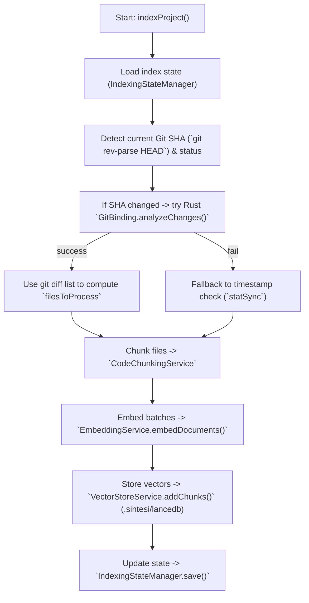

<Callout type="info">This guide covers the most common failures surfaced by the RAG/indexing pipeline, embedding/vector store operations, and unit tests. All file paths and commands reference files and behavior present in the repository.</Callout>

## Quick clone

The repository URL or slug may differ between forks or reorganizations. Replace the example below with the canonical repo URL for your fork or organization.

Examples:

- HTTPS:

    ```bash
    git clone https://github.com/<owner>/<repo>.git
    cd <repo>
    ```

- SSH:
    ```bash
    git clone git@github.com:<owner>/<repo>.git
    cd <repo>
    ```

If you are following a public guide or ticket, verify the owner/repo values match the project you intend to inspect (for example, doctype/doctypedev or your fork). You can also use the repository URL from your project's README.

## Overview

This repository implements a Retrieval-Augmented Generation (RAG) pipeline used by the CLI. The key components to check when things break are:

- `RetrievalService.indexProject()` — incremental indexer (packages/cli/src/services/rag/retrieval-service.ts).
- `EmbeddingService` — embedding generation (packages/cli/src/services/rag/embedding-service.ts).
- `VectorStoreService` (LanceDB) — persistent vector store under the `.sintesi` workspace.
- Native core / GitBinding — Rust NAPI bindings (crates/core) used for fast git diffs.
- Tests under `packages/cli/__tests__` (e.g., `changeset.test.ts`, `indexing-state.test.ts`).

Below are focused troubleshooting steps, diagnostics, and where to look in the codebase and on disk.

## Diagnostic flow (mermaid)



## Where to look first

- Indexing logic: `packages/cli/src/services/rag/retrieval-service.ts`
    - Git SHA and working tree checks use `execSync('git rev-parse HEAD')` and `execSync('git status --porcelain')`.
    - If previous SHA differs, it calls `new GitBinding(this.projectRoot).analyzeChanges(lastSha)` (Rust binding).
    - Fallback logic uses file timestamps via `statSync`.
    - Deletion operations call `this.vectorStore.deleteChunks(...)`.
    - Embedding is performed by `this.embeddingService.embedDocuments(...)` in batches.
- Embeddings: `packages/cli/src/services/rag/embedding-service.ts`
    - Reads `process.env.OPENAI_API_KEY` and optionally `process.env.HELICONE_API_KEY`.
    - Default model: the code typically selects `text-embedding-3-small` unless overridden. NOTE: the exact model string can be determined at runtime (see the embedding service implementation) — inspect `embedding-service.ts` to confirm whether the model is a hard-coded constant, derived from an env var, or selected from provider settings.
    - Errors are logged via `this.logger.error(...)`.
- Vector store and persistence:
    - Vector store backed by LanceDB and persisted in the `.sintesi` workspace (see RAG README: `VectorStoreService` uses `.sintesi/lancedb`).
    - Index state is managed by `IndexingStateManager` (tests at `packages/cli/__tests__/indexing-state.test.ts`) and stored under `./.sintesi`.
- Native Rust binding (GitBinding): `crates/core` and its NAPI exports referenced in `crates/core/src/napi/mod.rs`.
    - If the native binding is missing or incompatible, the code logs a warning and falls back to timestamp-based indexing.

## Common problems & step-by-step fixes

### 1) Indexing reports "Index is up to date" but new changes are ignored

Why it happens:

- `RetrievalService` compares `currentSha` to the last persisted SHA. If they match and the workspace is clean, it exits early.
  Diagnostics:
- Run the git checks the indexer uses:
    ```bash
    git rev-parse HEAD
    git status --porcelain
    ```
- Check index state (look for files under `./.sintesi`).
  Where to look:
- `packages/cli/src/services/rag/retrieval-service.ts`
- `IndexingStateManager` implementation and tests: `packages/cli/__tests__/indexing-state.test.ts`
  Fixes:
- Ensure files are committed if you expect the comparator to use commit SHAs (or force re-index).
- If you intentionally want to re-index, either remove the saved state under `./.sintesi` or run a command that forces indexing (the CLI exposes a `--force` style behavior in code paths — consult the CLI entrypoint you use).

### 2) Git diff via `GitBinding` fails (Rust native binding) and you see fallback behavior

Why it happens:

- Native binding may not be present, incompatible, or throw in `analyzeChanges`.
  Diagnostics:
- Inspect logs for the exact warning emitted by the catch where `GitBinding.analyzeChanges()` is called. Open `packages/cli/src/services/rag/retrieval-service.ts` and find the try/catch around `analyzeChanges()` to see the exact message the code logs. Example search terms you can use:
    - Search for the exact logger call in the source:
        - grep for "analyzeChanges" or search for `GitBinding` usage in `retrieval-service.ts`.
    - Search logs for phrases similar to:
        - Failed to compute git diff using Rust binding
        - Falling back to timestamp check
- IMPORTANT: the exact log string can change between commits. If you rely on a log string for automation or debugging, copy the literal string from the code (the logger call in the catch block).
  Where to look:
- `packages/cli/src/services/rag/retrieval-service.ts` logs the catch and fallback.
- Native artifacts in `crates/core` and platform-specific npm packages (see `crates/core/README.md`).
  Fixes:
- Rebuild native core following `crates/core/README.md` build steps.
- If rebuilding isn’t possible, timestamp fallback still works — ensure file timestamps change (e.g., `touch` files) to trigger reindexing.

### 3) Embedding generation fails or returns empty vectors

Why it happens:

- Missing or invalid `OPENAI_API_KEY`.
- Helicone proxy incorrectly configured; Helicone fallback may throw.
- External API rate limits or network errors.
  Diagnostics:
- Check logs for:
    - a warning that the API key is missing (the exact text is emitted from `EmbeddingService` constructor — inspect `embedding-service.ts` for the exact message).
    - a debug line indicating embedding model and batch size (inspect the file to confirm the literal message; the code commonly logs something like `Generating embeddings for X chunks using text-embedding-3-small...`, but confirm the running code).
    - `Embedding generation failed: <message>` (or similar exact error logged by the catch).
- The code path to inspect: `packages/cli/src/services/rag/embedding-service.ts`.
  Where to look:
- `EmbeddingService` constructor for warnings about `OPENAI_API_KEY` and `HELICONE_API_KEY`.
- Calls to `embedMany(...)` and its catch where errors are logged and thrown.
  Fixes:
- Ensure `OPENAI_API_KEY` is set in your environment:
    ```bash
    export OPENAI_API_KEY="sk_..."
    ```
- If you use Helicone, confirm `HELICONE_API_KEY` is valid and that any proxy `baseURL`/headers are allowed.
- Re-run indexer. If embedding still fails, inspect network access and provider limits.

Notes about the embedding model default:

- The code commonly uses `text-embedding-3-small` as the default model. However, the exact effective model may be:
    - a hard-coded constant in `embedding-service.ts`, or
    - selected at runtime based on env vars or provider configuration (for example, an env var such as `OPENAI_EMBEDDING_MODEL` or provider-specific settings).
- Always verify the exact default by opening `packages/cli/src/services/rag/embedding-service.ts` and locating the model selection logic if you need deterministic behavior.

### 4) Vector store operations fail (add/delete chunks)

Why it happens:

- Disk permission issues under `./.sintesi` or corrupted LanceDB files.
  Diagnostics:
- Look for logs around `this.vectorStore.addChunks(...)` and `this.vectorStore.deleteChunks(...)` in `retrieval-service.ts`.
- Inspect the `.sintesi` directory: `ls -la .sintesi` and `ls -la .sintesi/lancedb`.
  Where to look:
- `packages/cli/src/services/rag` for vector store wrapper implementation and RAG README noting `.sintesi/lancedb`.
  Fixes:
- Ensure the CLI process user has write permission to the repository workspace and `.sintesi`.
- Backup and (if acceptable) remove or recreate `.sintesi/lancedb` to force a fresh vector store.
- Re-run indexing to rebuild the store.

### 5) Partial embedding success: some batches embed, others fail

Why it happens:

- Per-batch network or API intermittent errors; `embedMany` might fail for a batch and the code logs batch-level failures.
  Diagnostics:
- Search logs for the exact batch-failure messages emitted by `retrieval-service.ts` (open the file and copy the literal text used in `logger.error` for batch failures).
  Where to look:
- The embedding loop and `catch` in `retrieval-service.ts`.
  Fixes:
- Re-run indexing; intermittent errors often succeed on retry.
- Decrease batch size in code if you have a very constrained API quota.

Batching constant note:

- The code uses a batching constant to control how many texts are sent to the embedding API per request. Commonly this is named `TEXTS_PER_BATCH` and is set to 20 in many examples, but the exact name and value may change. To avoid confusion:
    - Open `packages/cli/src/services/rag/retrieval-service.ts` and confirm the constant name and value used in your branch (search for `TEXTS_PER_BATCH`, `BATCH_SIZE`, or similar).
    - Edit that constant in-place to tune the batching behavior for your environment.

### 6) Tests failing related to native bindings or dependency resolution

What to inspect:

- Tests mock `@sintesi/core` in several places to avoid native binding issues (see `packages/cli/__tests__/changeset.test.ts`).
- `changeset.test.ts` validates that `changesetCommand` checks for `@changesets/cli` using `createRequire` and handles missing dependency by returning `success: false` and an error mentioning `@changesets/cli not installed`.
  Where to look:
- `packages/cli/__tests__/changeset.test.ts`
- `packages/cli/__tests__/indexing-state.test.ts`
- `packages/cli/__tests__/markdown-builder.test.ts`
- `packages/cli/__tests__/package-selector.test.ts`
  Diagnostics & fixes:
- If tests fail with missing native modules, ensure any test-time mocks are correct. The repository intentionally mocks `@sintesi/core` in tests to avoid native binding issues.
- Run a single test file for faster debugging:
    ```bash
    npx vitest packages/cli/__tests__/changeset.test.ts
    ```
- Inspect test mocks: tests often mock `child_process.execSync`, `module.createRequire`, or `@sintesi/core`. Failures may indicate the mock setup doesn’t match runtime expectations.

CI vs local / environment requirements:

- Unit tests and many CI job configurations commonly use mocks for `@sintesi/core` and AI provider clients. As a result:
    - Unit tests may run successfully in CI without a real `OPENAI_API_KEY` or without a built native `@sintesi/core` binding.
    - End-to-end or integration runs (running the indexer against a real provider or running code paths that call the native binding) require:
        - A valid `OPENAI_API_KEY` (and/or other provider keys) in the environment for real embedding calls.
        - The native `@sintesi/core` module built for your platform if you want the GitBinding path (follow `crates/core/README.md`).
    - If you are replicating an issue locally, confirm whether the failing test is a unit test with mocks (no API key required) or an integration path that needs the API keys and/or native binding.

## CLI flags and command args (references present in tests)

| Flag / Arg   |    Type | Behavior (from tests / code)                                                           |
| ------------ | ------: | -------------------------------------------------------------------------------------- |
| `baseBranch` |  string | Branch used as base for operations (example: `'main'` or `'develop'`)                  |
| `forceFetch` | boolean | When `true`, test expects a `git fetch origin <baseBranch>` call in `changesetCommand` |
| `noAI`       | boolean | Used in tests to skip AI-dependent paths (speeds up tests)                             |

## Configuration & environment (table)

| Property / Env     |                  Required?                   | Purpose / Where used                                                                                                       |
| ------------------ | :------------------------------------------: | -------------------------------------------------------------------------------------------------------------------------- |
| `OPENAI_API_KEY`   | yes (for embeddings in E2E/integration runs) | Used by `EmbeddingService` to call OpenAI embeddings (commonly `text-embedding-3-small` unless overridden in code or env). |
| `HELICONE_API_KEY` |                   optional                   | If present, `EmbeddingService` and AI providers use Helicone proxy for observability/caching.                              |
| `COHERE_API_KEY`   |                   optional                   | Reranking (RAG) – documented in RAG README.                                                                                |
| `.sintesi/lancedb` |                     n/a                      | Vector store persisted by `VectorStoreService` (LanceDB).                                                                  |
| `./.sintesi`       |                     n/a                      | Index state managed by `IndexingStateManager` (see indexing-state tests).                                                  |

## Useful commands & checks

- Check git SHA and status (mirrors indexer logic):

```bash
git rev-parse HEAD
git status --porcelain
```

- Inspect `.sintesi` workspace:

```bash
ls -la .sintesi
ls -la .sintesi/lancedb
```

- Run a quick indexing example (from RAG README) — create `scripts/run-index.ts`:

```typescript
// scripts/run-index.ts
import { Logger } from './packages/cli/src/utils/logger';
import { RetrievalService } from './packages/cli/src/services/rag/retrieval-service';

(async () => {
    const logger = new Logger(true); // enable debug if logger supports it
    const svc = new RetrievalService(logger, process.cwd());
    await svc.indexProject();
})();
```

Run it with:

```bash
node --loader ts-node/esm scripts/run-index.ts
```

(Adjust runtime invocation to your environment and TypeScript setup.)

## Logging and increasing verbosity

- The indexer, embedding service, and AI provider use `this.logger.*` calls (`info`, `debug`, `warn`, `error`, `success`). Search the codebase for `logger.debug` / `logger.warn` / `logger.error` to find useful log points.
- Many tests construct `new Logger(false)` or `new Logger(true)` (see `packages/cli/__tests__/package-selector.test.ts`) — if the constructor accepts a boolean, passing `true` may enable debug logging (inspect `packages/cli/src/utils/logger` for exact API).

When relying on log messages for debugging or automation:

- Prefer copying the exact string from the source files (e.g., the message passed to `logger.warn` in `retrieval-service.ts`) and then search logs for that literal string.
- If you only have a rough fragment, search for the code site (file and line) and confirm the current literal message used by the running version.

## Recovery patterns

- If indexing stalls or embedding fails repeatedly:
    1. Confirm `OPENAI_API_KEY` and network connectivity (for real embedding calls).
    2. Stop processes that may lock `.sintesi/lancedb`.
    3. Backup `.sintesi` and remove it to rebuild from scratch.
    4. Re-run indexing to rebuild embeddings and state.
- If GitBinding (Rust) is missing:
    1. Rebuild the native crate following `crates/core/README.md`.
    2. If rebuild not possible, rely on timestamp fallback (ensure files’ `mtime` changes).

## When to open an issue

Include the following in your report:

- Exact error log lines (copy the literal messages from the run; examples to look for in the code are messages emitted around embedding failures, GitBinding fallbacks, and batch failures — copy them from the source or logs).
- Full stdout/stderr from the failing run.
- A brief description of whether you ran indexing in a dirty workspace or on a clean commit.
- Contents (listing) of `./.sintesi` and `./.sintesi/lancedb`.
- Results of `git rev-parse HEAD` and `git status --porcelain`.
- Which tests fail and their output when running `npx vitest <path-to-test>`.
- Whether the failing run was a unit test (which may use mocks) or an integration/e2e run (which may require API keys and native bindings).

<Callout type="info">If you suspect a native binding issue with `@sintesi/core`, tests often mock that module; check `packages/cli/__tests__/changeset.test.ts` for examples of how native bindings are mocked in CI or test environments. For end-to-end runs, provide the environment (API keys present, native binding built) information when filing an issue.</Callout>

## Quick references

- Indexing core logic: `packages/cli/src/services/rag/retrieval-service.ts`
- Embeddings: `packages/cli/src/services/rag/embedding-service.ts`
- RAG README: `packages/cli/src/services/rag/README.md`
- Indexing state tests: `packages/cli/__tests__/indexing-state.test.ts`
- Changeset tests (dependency resolution & `git fetch` behavior): `packages/cli/__tests__/changeset.test.ts`
- Native core (NAPI/Rust): `crates/core/src/napi/mod.rs` and `crates/core/README.md`

If you cannot resolve an issue after following these steps, prepare logs and the details requested above and open an issue in the repository with the `📁 .sintesi` directory listing and the exact failing command or test.
