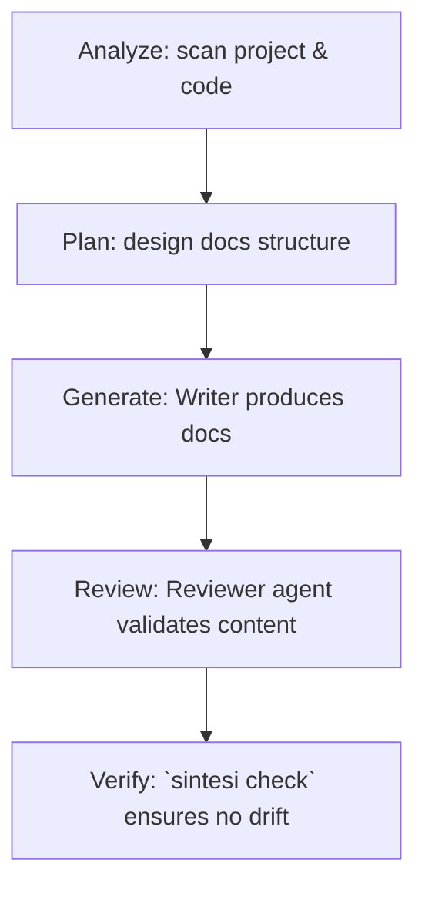

## What is Sintesi

Sintesi is a self-maintaining documentation engine that keeps your documentation in sync with your codebase. It uses **multi-agent AI** and **Retrieval-Augmented Generation (RAG)** to analyze source code, plan documentation structure, generate content, and verify drift so docs never rot.

Sintesi is monorepo-native and ships a CLI named `sintesi` that runs documentation generation, README generation, and drift checks.

<Callout type="info">
Install the CLI globally to use the `sintesi` commands shown below. For CI usage see the GitHub Action example.
</Callout>

## Get the code and install the CLI

Clone the repository:

```bash
git clone https://github.com/doctypedev/sintesi.git
cd sintesi
```

Install the published CLI globally:

```bash
npm install -g @sintesi/sintesi
```

You can also build the monorepo locally (requires `pnpm`):

```bash
pnpm install
pnpm -w build
```

## One-line command examples

Use these one-liners to run the most common, verified workflows.

```bash
# Release (runs changesets then publishes)
pnpm run release
```

```bash
# Run drift checks (CI-friendly)
sintesi check
```

```bash
# Generate or update README.md based on repository context
sintesi readme
```

```bash
# Generate project documentation (site-friendly structure by default)
sintesi documentation
```

Force regeneration (bypass existing docs checks):

```bash
sintesi readme --force
sintesi documentation --force
```

## CLI Flags (selected, verified)

| Flag          | Applies To                | Description                                                          |
| ------------- | ------------------------- | -------------------------------------------------------------------- |
| `--force`     | `readme`, `documentation` | Ignore existing output and regenerate from scratch.                  |
| `--no-strict` | `check`                   | Allow non-blocking CI usage (do not fail the pipeline on detection). |
| `--readme`    | `check`                   | Run check only for the `README.md`.                                  |
| `--doc`       | `check`                   | Run check only for the documentation site.                           |

> For a complete, up-to-date list of flags and options consult the CLI reference: https://sintesicli.dev/reference/commands.html

## Typical workflow



## CI example (summary)

Integrate Sintesi into CI to run checks and optionally create or update docs via a workflow step. In CI you typically provide AI/embedding credentials as secrets (for RAG features) and run the `sintesi` commands or use the supplied GitHub Action.

- Provide OPENAI_API_KEY if you use OpenAI for embeddings (required when using OpenAI as the embeddings provider).
- COHERE_API_KEY is optional and enables reranking in the RAG pipeline.

See the repository README and the CLI reference for a full CI example and action inputs.

## Notes

Sintesi ships a root `pnpm` script:

- `pnpm run release` — convenience script that runs `pnpm changeset version && pnpm changeset publish` as defined in the root `package.json`.

The `documentation` command generates an opinionated, site-ready structure by default. The historical `--site` flag has been removed; the CLI now produces site-structured output without that flag.

For more details about the architecture, RAG pipeline, and agent roles, see the project docs and CLI reference linked above.
