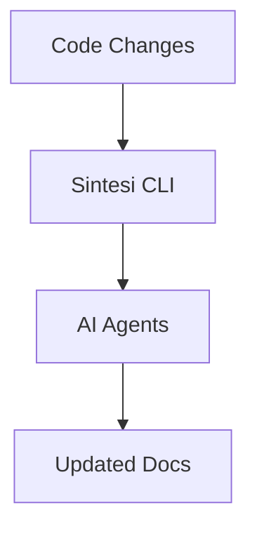

## Quick Start

Install the Sintesi CLI (global install recommended for CI or local usage):

```bash
npm install -g @sintesi/sintesi
```

### Core Workflow



### Common Commands

::: code-group

```bash [Generate Docs]
# Generate documentation for the current project
sintesi documentation
```

```bash [Check Drift]
# Verify documentation integrity
sintesi check
```

```bash [Update README]
# Generate a README based on project context
sintesi readme
```

:::

## Primary Use-Cases

- **CLI for automated documentation**: A lightweight, scriptable command-line interface that drives documentation generation, verification, and changeset creation.
- **RAG-enabled doc generation**: AI-assisted generation that reads actual source code, indexes context, and writes up-to-date documentation.
- **Monorepo-aware workflows**: Detects monorepo structure, maps changes to affected packages, and supports per-package updates and changesets.

---

## CLI Reference Summary

| Command         | Description                                           |
| :-------------- | :---------------------------------------------------- |
| `readme`        | Generate a `README.md` based on project context.      |
| `documentation` | Generate comprehensive documentation site structure.  |
| `check`         | Verify documentation is in sync with code.            |
| `changeset`     | Generate a changeset file from code changes using AI. |

> **Note**: The CLI surface is implemented in the `packages/cli` workspace. Commands documented here map to the code paths under `packages/cli`.
