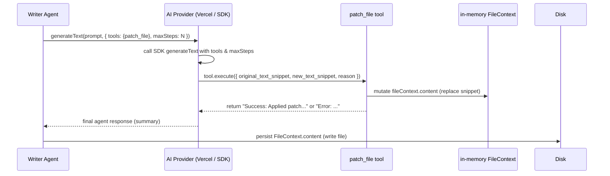

## Overview

This page documents:

- The GenerateTextOptions type (fields and semantics).
- How AI providers should accept and forward `tools` and `maxSteps`.
- The contract of the `patch_file` tool: its input schema, return values, and how it mutates an in-memory file context.

These changes enable multi-step agent workflows and surgical (in-place) updates of documentation files.

<Callout type="info">
The repository for this codebase is: https://github.com/doctypedev/sintesi
</Callout>

---

## GenerateTextOptions

Location: packages/ai/types.ts

Type definition (concise):

- temperature?: number
    - Controls randomness. Lower values → deterministic output.
- maxTokens?: number
    - Maximum number of tokens the generation should produce.
- tools?: Record<string, unknown>
    - Map of tool name → tool object. Tools are provider/SDK-specific tool objects (Vercel AI SDK style).
- maxSteps?: number
    - Maximum number of tool roundtrips / reasoning steps the model/agent may perform.

Concrete TypeScript (as defined in repo):

```ts
export interface GenerateTextOptions {
    temperature?: number;
    maxTokens?: number;
    /** Vercel AI SDK Tools (Record<string, CoreTool>) */
    tools?: Record<string, unknown>;
    /** Maximum number of tool roundtrips */
    maxSteps?: number;
}
```

Usage (example from DocumentationBuilder):

```ts
await aiAgents.writer.generateText(
    updatePrompt,
    {
        maxTokens: 4000,
        temperature: 0.1,
        tools: { patch_file: patchTool },
        maxSteps: 5, // allow up to 5 patch operations
    },
    metadata,
);
```

---

## Provider responsibilities

Any provider implementing IAIProvider.generateText should:

1. Accept the `GenerateTextOptions` parameter (optional).
2. Forward `tools` and `maxSteps` into the underlying SDK `generateText` call (or equivalent) when the SDK supports them.
3. Respect model-specific parameter restrictions if required by the SDK or model.

Concrete guidance (notes and examples):

- Standard generation:
    - Set temperature and maxTokens using:
        - options.temperature ?? modelConfig.temperature
        - options.maxTokens ?? modelConfig.maxTokens ?? 1000

- Reasoning models (implementation-specific handling):
    - Some providers and SDKs treat "reasoning" style models differently (for example, they may ignore or disallow external temperature/maxTokens overrides because the model or API handles lengths/sequencing differently). This is implementation-specific.
    - As an implementation example only (not authoritative for this repo), some codebases use a heuristic such as checking model IDs that start with `o1-` or `o3-`:
        - Example heuristic: `/^o[13]-/.test(this.modelConfig.modelId)`
    - Do not assume this exact heuristic exists in every provider implementation. Verify your provider/SDK behavior and adapt accordingly.

- Always forward tools and maxSteps if provided and if the underlying SDK supports them:
    - genOptions.tools = options.tools
    - genOptions.maxSteps = options.maxSteps

Example provider forwarding (pseudo-TS; implementation example):

```ts
const genOptions: any = { model, prompt };

// If your provider requires skipping temperature/maxTokens for certain models,
// implement that check here. The specific condition is provider-specific.
if (!isReasoningModel) {
    genOptions.temperature = options.temperature ?? this.modelConfig.temperature;
    genOptions.maxTokens = options.maxTokens ?? this.modelConfig.maxTokens ?? 1000;
}

// Forward tools and maxSteps if present and supported by the SDK
if (options.tools) genOptions.tools = options.tools;
if (options.maxSteps) genOptions.maxSteps = options.maxSteps;

const result = await generateText(genOptions);
```

Note: The snippet above is an implementation example to illustrate the forwarding contract and optional model-specific branching. The repository's actual provider implementations may differ in how (or whether) they detect "reasoning" models and how they map parameters to an SDK.

Helicone / fallback behavior:

- Helicone is commonly used as an observability proxy in front of native providers. In some setups the provider client is initialized to use Helicone by default and can fall back to a native provider in certain initialization paths.
- The ground truth repository snippets do not show an automatic, provider-level retry-on-Helicone-failure sequence. If you expect retries when Helicone (or any proxy) fails, implement them explicitly in your provider or rely on the higher-level AIAgent retry mechanism (if present) to perform retries.
- If you implement a fallback path (initialization-time fallback or runtime retry), ensure the fallback invocation forwards the same `tools` and `maxSteps` options to the native provider so agent behavior remains consistent.

---

## patch_file tool — contract

The project provides a surgical edit tool used in the Writer agent flow. Implementation location: packages/cli/src/tools/patch-file.ts

Purpose:

- Apply targeted, search-and-replace edits to an in-memory file representation (surgical updates) instead of rewriting the whole file.

Creation:

- Use createPatchFileTool(fileContext) where:
    - fileContext is an object: { content: string; path: string }
    - The returned value is a tool object compatible with the Vercel AI SDK `tool` interface (it contains description, inputSchema, and an execute function).

Input schema (Zod) — exact fields:

```ts
const patchParametersSchema = z.object({
    original_text_snippet: z
        .string()
        .describe(
            'The exact literal text snippet to replace (including newlines/indentation). Must uniquely identify the section.',
        ),
    new_text_snippet: z.string().describe('The new text content to replace the old snippet with.'),
    reason: z.string().describe('The reason for this change.'),
});
```

Execute contract / behavior:

- The tool mutate-in-place: it updates `fileContext.content` directly (the fileContext object passed to createPatchFileTool is mutated).
- The tool returns a string describing the result. Known return messages (from implementation):
    - Success:
        - `Success: Applied patch for "REASON".`
        - `Success: Applied patch for "REASON" (normalized line endings).`
    - Error cases:
        - `Error: Could not find the exact snippet in <path>. Ensure you are quoting the existing text exactly.`
        - `Error: The snippet provided matches <N> locations in <path>. Please provide more surrounding context to ensure uniqueness.`
        - For normalized line endings: `Error: The snippet provided matches <N> locations in <path> (after normalizing line endings). Please provide more surrounding context to ensure uniqueness.`

Algorithm summary (implementation details):

1. If `original_text_snippet` is absent from `fileContext.content`, attempt normalization by converting CRLF to LF and retry.
2. If the normalized snippet appears more than once, return an error mentioning the count (prevents ambiguous replacements).
3. If unique, replace the first (and only) occurrence of the snippet with `new_text_snippet`.
4. Mutate `fileContext.content` with the new content and return a success string.

Important semantic guarantees:

- Uniqueness check: the tool refuses to apply a patch when the snippet matches multiple locations to avoid accidental multiple replacements.
- The tool does not write to disk — it only mutates the provided in-memory `fileContext`. Calling code is responsible for persisting `fileContext.content` to disk after all tool invocations complete (see DocumentationBuilder).
- The tool expects exact snippets (including indentation and newlines). If line ending differences are suspected, it normalizes and attempts again.

Example tool creation and usage (from DocumentationBuilder):

```ts
const fileContext = { content: currentContent, path: item.path };
const patchTool = createPatchFileTool(fileContext);

const summary = await aiAgents.writer.generateText(
    updatePrompt,
    {
        maxTokens: 4000,
        temperature: 0.1,
        tools: { patch_file: patchTool },
        maxSteps: 5,
    },
    metadata,
);

// After agent finishes, fileContext.content holds the updated file content.
// Persist it:
writeFileSync(fullPath, fileContext.content);
```

---

## Surgical update flow (sequence)



---

## Recommendations for provider implementers

- Always accept `GenerateTextOptions` in your `generateText` implementation and treat `tools` and `maxSteps` as opt-in, forwarding them to the underlying SDK call when supported by the SDK.
- Retain model-specific handling:
    - If your model or SDK requires special parameters or naming (e.g., `maxCompletionTokens`), map accordingly for reasoning models. Confirm whether your provider/SDK requires skipping or remapping parameters rather than relying on heuristics.
- Ensure errors from tool executions bubble up as actionable messages to the calling agent so the agent can decide to retry, reduce steps, or provide more context.
- When implementing Helicone or other observability proxies, consider:
    - Whether you will configure the provider to use Helicone as a proxy at initialization and whether you need an explicit fallback initialization path to the native provider.
    - If you expect automatic retries on Helicone failures, either implement retry/fallback semantics in the provider or rely on the AIAgent's retry mechanism. On fallback attempts, forward the same `tools` and `maxSteps` so the agent's behaviour is preserved.

---

## Examples

1. DocumentationBuilder (surgical update mode — actual code in repo):

```ts
// create in-memory context and patch tool
const fileContext = { content: currentContent, path: item.path };
const patchTool = createPatchFileTool(fileContext);

// instruct writer agent to use the tool
const summary = await aiAgents.writer.generateText(
    updatePrompt,
    {
        maxTokens: 4000,
        temperature: 0.1,
        tools: { patch_file: patchTool },
        maxSteps: 5,
    },
    metadata,
);

// after generator returns, fileContext.content has been mutated
finalContent = fileContext.content;
writeFileSync(fullPath, finalContent);
```

2. Minimal provider forwarding (implementation example):

```ts
const genOptions: any = { model, prompt };

// Example branch to skip temperature/maxTokens for certain models.
// This is an example pattern; the repository's provider code may differ.
if (!isReasoningModel) {
    genOptions.temperature = options.temperature ?? this.modelConfig.temperature;
    genOptions.maxTokens = options.maxTokens ?? this.modelConfig.maxTokens ?? 1000;
}

if (options.tools) genOptions.tools = options.tools;
if (options.maxSteps) genOptions.maxSteps = options.maxSteps;

const res = await generateText(genOptions);
return res.text;
```

---

## Notes

<Callout type="info">
- The patch-file tool intentionally returns plain strings (success/error). Calling code interprets them as summaries for operator visibility and debugging.
- The in-memory mutation pattern makes it explicit that the AI agent is performing surgical edits; persistence is handled by the builder after the agent finishes.
</Callout>
