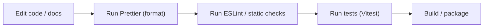

## Overview

This page documents the repository-level configuration files used by Sintesi. It covers: environment variables, formatting and linting configuration, TypeScript compiler settings, and test/tooling configuration contributors will commonly interact with.

<Callout type="info">Always copy `.env.example` to `.env` and populate secrets locally. Do **not** commit real API keys into the repository.</Callout>

## Quick workflow

Use the following local workflow to keep your changes consistent:



## Environment variables (`.env.example`)

Copy `.env.example` to `.env` and replace placeholder values with real secrets.

| Name               | Required? | Purpose                                                                                                                    |
| ------------------ | --------: | -------------------------------------------------------------------------------------------------------------------------- |
| `OPENAI_API_KEY`   |       yes | API key for OpenAI. Required for AI-powered documentation generation.                                                      |
| `HELICONE_API_KEY` |        no | Optional Helicone key for AI observability and cost tracking. When set, AI requests are tracked in the Helicone dashboard. |
| `COHERE_API_KEY`   |        no | Key for Cohere embeddings / reranking (used by RAG features).                                                              |
| `GEMINI_API_KEY`   |        no | Alternative provider placeholder (commented, not currently supported).                                                     |

Example (`.env`):

```text
OPENAI_API_KEY=sk-your-openai-api-key-here
# Optional: HELICONE_API_KEY=sk-helicone-your-api-key-here
COHERE_API_KEY=your-cohere-api-key-here
```

<Callout type="info">If you use any of these services, add keys to your local `.env`. The repository uses these to enable RAG and AI features in the CLI.</Callout>

## Formatting and linting

The repository provides Prettier and ESLint configuration at the root.

### Prettier

- Config file: `.prettierrc`
- Ignore file: `.prettierignore`

`.prettierrc` (root settings):

```json
{
    "semi": true,
    "trailingComma": "all",
    "singleQuote": true,
    "printWidth": 100,
    "tabWidth": 4
}
```

`.prettierignore` (common ignores):

```text
dist
node_modules
coverage
.sintesi
.git
pnpm-lock.yaml
```

Formatting example (used by the documentation builder):

```bash
npx prettier --write "OUTPUT_DIR/**/*.md"
```

Replace `OUTPUT_DIR` with the directory you want to format. The project uses `npx` to prefer the local Prettier if available.

### ESLint

Root ESLint config: `.eslintrc.js`

Key points from the file:

- Parser: `@typescript-eslint/parser`
- Extends: `eslint:recommended`, `plugin:@typescript-eslint/recommended`, `prettier`
- Notable rules:
    - `@typescript-eslint/no-unused-vars`: `error` (ignores args starting with `_`)
    - `@typescript-eslint/explicit-function-return-type`: `warn`
    - `@typescript-eslint/no-explicit-any`: `warn`

`.eslintrc.js` (excerpt):

```javascript
module.exports = {
    parser: '@typescript-eslint/parser',
    extends: ['eslint:recommended', 'plugin:@typescript-eslint/recommended', 'prettier'],
    parserOptions: {
        ecmaVersion: 2022,
        sourceType: 'module',
    },
    rules: {
        '@typescript-eslint/no-unused-vars': ['error', { argsIgnorePattern: '^_' }],
        '@typescript-eslint/explicit-function-return-type': 'warn',
        '@typescript-eslint/no-explicit-any': 'warn',
    },
};
```

## TypeScript configuration (`tsconfig.json`)

Top-level TypeScript config governs compilation for packages under `packages/`.

`include` and `exclude` scope:

- `include`: `"packages/**/*"`
- `exclude`: `node_modules`, `dist`, `crates`, test/spec files, `__tests__`, and `examples`

Key `compilerOptions` (summary table):

| Option                                  | Value        | Purpose                                                |
| --------------------------------------- | ------------ | ------------------------------------------------------ |
| `target`                                | `ES2022`     | Output language target.                                |
| `module`                                | `commonjs`   | Module system used for output.                         |
| `lib`                                   | `["ES2022"]` | Standard library support.                              |
| `outDir`                                | `./dist`     | Where compiled files are emitted.                      |
| `rootDir`                               | `./packages` | Root of source files.                                  |
| `strict`                                | `true`       | Enables all strict type-checking options.              |
| `esModuleInterop`                       | `true`       | Enables compatibility interop for CommonJS/ES modules. |
| `resolveJsonModule`                     | `true`       | Allows importing JSON files.                           |
| `declaration`                           | `true`       | Emits `.d.ts` declaration files.                       |
| `declarationMap`                        | `true`       | Emits declaration maps.                                |
| `sourceMap`                             | `true`       | Emits source maps.                                     |
| `noUnusedLocals` / `noUnusedParameters` | `true`       | Fail on unused locals/parameters.                      |
| `noImplicitReturns`                     | `true`       | Ensure functions always return if they claim to.       |
| `noFallthroughCasesInSwitch`            | `true`       | Prevent fallthrough in `switch` statements.            |

Full configuration (root `tsconfig.json`):

```json
{
    "compilerOptions": {
        "target": "ES2022",
        "module": "commonjs",
        "lib": ["ES2022"],
        "outDir": "./dist",
        "rootDir": "./packages",
        "strict": true,
        "esModuleInterop": true,
        "skipLibCheck": true,
        "forceConsistentCasingInFileNames": true,
        "moduleResolution": "node",
        "resolveJsonModule": true,
        "declaration": true,
        "declarationMap": true,
        "sourceMap": true,
        "noUnusedLocals": true,
        "noUnusedParameters": true,
        "noImplicitReturns": true,
        "noFallthroughCasesInSwitch": true
    },
    "include": ["packages/**/*"],
    "exclude": [
        "node_modules",
        "dist",
        "crates",
        "**/*.test.ts",
        "**/*.spec.ts",
        "**/__tests__/**",
        "**/examples/**"
    ]
}
```

## Test and tooling config (Vitest)

Root `vitest.config.ts` configures unit testing and resolver aliases.

Key settings:

- Test environment: `node`
- Include pattern: `packages/**/*.{test,spec}.ts`
- Coverage provider: `v8`
- Coverage reporters: `text`, `json`, `html`, `lcov`
- Coverage thresholds: `branches: 80`, `functions: 80`, `lines: 80`, `statements: 80`
- Aliases:
    - `@` -> `./packages`
    - package-specific aliases (example): `@sintesi/core` -> `./packages/core/index.ts`

Important: confirm aliases in your repository's `vitest.config.ts` — aliases are project-specific and may differ. If your repo uses a different alias or path, update the config (and this documentation) accordingly.

Excerpt (important parts):

```ts
export default defineConfig({
    test: {
        globals: true,
        environment: 'node',
        include: ['packages/**/*.{test,spec}.ts'],
        exclude: ['node_modules', 'dist', 'crates'],
        coverage: {
            provider: 'v8',
            reporter: ['text', 'json', 'html', 'lcov'],
            include: ['packages/**/*.ts'],
            exclude: [
                'packages/**/*.d.ts',
                'packages/**/*.test.ts',
                'packages/**/*.spec.ts',
                'packages/**/__tests__/**',
            ],
            thresholds: {
                branches: 80,
                functions: 80,
                lines: 80,
                statements: 80,
            },
        },
    },
    resolve: {
        alias: {
            '@': path.resolve(__dirname, './packages'),
            // Example package alias — verify in your repo:
            // '@sintesi/core': path.resolve(__dirname, './packages/core/index.ts'),
        },
    },
});
```

To quickly check the actual aliases in your local clone, open `vitest.config.ts` at the repository root or run a search for `resolve: { alias` in the repo.

## Notes for contributors & CI

- Repository URL: verify and use your repository's canonical remote URL (do not rely on a hardcoded value in documentation). You can get the configured remote URL with:
    - git remote get-url origin
    - or check your CI settings for the repository URL to use in workflows.
- Keep secrets out of Git. Use local `.env` and ensure it is ignored by Git.
- The documentation build process attempts to format generated markdown using Prettier with the command shown above. If Prettier fails, the process logs a warning and continues.

<Callout type="info">If you need to debug formatting of generated docs, check the doc-builder logs — it runs `npx prettier --write "OUTPUT_DIR/**/*.md"` and prints failures without failing the whole run.</Callout>

## Files referenced

- `.env.example` — sample environment variables (copy to `.env`)
- `.eslintrc.js` — ESLint configuration
- `.prettierrc` — Prettier configuration
- `.prettierignore` — files ignored by Prettier
- `tsconfig.json` — root TypeScript config
- `vitest.config.ts` — test config and aliases

## Example: Add your `.env`

1. Copy the example:

```bash
cp .env.example .env
```

2. Edit `.env` and add your keys:

```text
OPENAI_API_KEY=sk-your-openai-api-key-here
COHERE_API_KEY=your-cohere-api-key-here
```

That is all you need to get started with AI features and local development configuration.
