<Callout type="info">
This document describes the N‑API surface implemented in the `crates/core` Rust crate and how the TypeScript layer consumes it (see `packages/core/index.ts`). All examples use the Node/TypeScript friendly names exported by the package.
</Callout>

## Overview

The Sintesi core exposes high-performance Rust components to Node.js via `napi-rs`. The N‑API layer is a thin wrapper that maps Rust types and functions into JavaScript-friendly objects and functions. The primary modules exposed to Node are:

- `ast` — AST analysis and signature extraction (`AstAnalyzer`)
- `content` — File discovery and Markdown anchor extraction
- `context` — Project/file context (project graph summary)
- `crawler` — Filesystem crawling (module exported; Rust implementation)
- `graph` — Project graph analysis (module exported; Rust implementation)
- `git` — Git-related helpers (module exported; Rust implementation)
- `utils` — Miscellaneous helpers used by N‑API (module exported; Rust implementation)

TypeScript re-exports the native bindings in `packages/core/index.ts` (via `native-loader`) so TypeScript code imports these names directly (for example `AstAnalyzer`, `discoverFiles`, `extractAnchors`, `getProjectContext`, `GitBinding`, `GraphAnalyzer`).

## How TypeScript interacts with the Rust N‑API layer

TypeScript imports the native bindings from the `native-loader` entry. The N‑API layer exposes:

- Plain functions (e.g., `discoverFiles`, `validateMarkdownAnchors`, `parseCodeRef`).
- Classes for stateful logic (e.g., `AstAnalyzer`).
- Structured objects for complex return values (e.g., `FileDiscoveryResult`, `ExtractionResult`).

Example re-exports from `packages/core/index.ts`:

```typescript
export {
    discoverFiles,
    extractAnchors,
    validateMarkdownAnchors,
    parseCodeRef,
    getProjectContext,
    AstAnalyzer,
    GitBinding,
    GraphAnalyzer,
} from './native-loader';
```

The Rust N‑API bindings return plain JS objects and arrays (converted from Rust structs), suitable for direct use in Node and TypeScript code.

## Module responsibilities

### AST (`ast`)

- Exposes `AstAnalyzer` class to Node.
- Responsibilities:
    - Parse TypeScript/JavaScript source using Oxc.
    - Extract exported symbols and normalize signatures.
    - Compute signature hashes (via `SignatureHasher` used internally).
- Exposed methods (N‑API names):
    - `new()` (constructor)
    - `analyzeFile(filePath: string): Array<CodeSignature>`
    - `analyzeCode(code: string): Array<CodeSignature>`
    - `analyzeWithErrors(code: string): AnalysisResultJs`
- Returned types:
    - `CodeSignature` contains `symbol_name`, `symbol_type`, `signature_text`, `is_exported`, and `hash`.
    - `AnalysisResultJs` contains `signatures: CodeSignature[]` and `errors: string[]`.

### Content (`content`)

- File discovery and markdown extraction.
- Responsibilities:
    - Discover source and markdown files on disk.
    - Extract Sintesi anchors from markdown files (anchor metadata, code references).
    - Validate anchor formatting without full extraction.
    - Parse simple `code_ref` strings of the form `file_path#symbol_name`.
- Exposed functions:
    - `discoverFiles(rootPath: string, options?: FileDiscoveryOptions): FileDiscoveryResult`
    - `extractAnchors(filePath: string, content: string): ExtractionResult`
    - `validateMarkdownAnchors(content: string): string[]`
    - `parseCodeRef(codeRef: string): CodeRefParts`
- Key N‑API objects:
    - `FileDiscoveryResult` — `markdown_files: string[]`, `source_files: string[]`, `total_files: number`, `errors: number`.
    - `FileDiscoveryOptions` — `respect_gitignore?: boolean`, `include_hidden?: boolean`, `max_depth?: number`.
    - `SintesiAnchor` — anchor metadata (id, code_ref, file_path, start_line, end_line, content).
    - `ExtractionResult` — `anchors: SintesiAnchor[]`, `anchor_count: number`, `errors: string[]`.
    - `CodeRefParts` — `{ file_path: string, symbol_name: string }`.

### Context (`context`)

- Exposes project-level summary information.
- Responsibilities:
    - Provide a lightweight `ProjectContext` describing files, per-file metadata and parsed `package.json`.
- N‑API objects:
    - `PackageJson` — `name?: string`, `version?: string`, `dependencies?: Record<string,string>`, `dev_dependencies?: Record<string,string>`, `scripts?: Record<string,string>`.
    - `FileContext` — `path: string`, `extension?: string`, `imports: string[]`, `imported_by: string[]`.
    - `ProjectContext` — `files: FileContext[]`, `package_json?: PackageJson`.
- Exposed function:
    - `getProjectContext(rootPath: string): ProjectContext`

### Crawler (`crawler`)

- Exposed via the N‑API module but implemented in Rust.
- Responsibilities (high-level, based on module role):
    - Traverse directories and build a list of files and metadata used by discovery and graph modules.
    - Handle `.gitignore` rules and traversal options (through `DiscoveryConfig` used by `discoverFiles`).

### Graph (`graph`)

- Exposed via the N‑API module as `GraphAnalyzer` (re-exported in TypeScript).
- Responsibilities (high-level):
    - Analyze module dependency graph, build import relationships and provide insights used by planners and other services.

### Git (`git`)

- Exposed via the N‑API module as `GitBinding` (re-exported in TypeScript).
- Responsibilities (high-level):
    - Provide Git related helpers (diffs, blame, change detection) to integrate project source metadata into planning and generation workflows.

### Utils (`utils`)

- Collection of small helpers used by the N‑API layer and TypeScript consumers. Exposed for convenience.

<Callout type="info">
The concrete function and object names above are the actual exported N‑API names used by the TypeScript layer (see `packages/core/index.ts` and the Rust N‑API sources in `crates/core/src/napi/`).
</Callout>

## Usage examples

### AST Analyzer (Node / TypeScript)

Create an analyzer and analyze a file or code string:

```typescript
import { AstAnalyzer } from '@sintesi/core'; // or from native-loader

const analyzer = new AstAnalyzer();

// Analyze a file (absolute or relative)
const signatures = analyzer.analyzeFile('src/index.ts');
console.log('Exported signatures:', signatures);

// Analyze raw code
const code = `
export function login(user: string) {
  return user;
}
`;
const sigsFromCode = analyzer.analyzeCode(code);
console.log(sigsFromCode);

// Get detailed analysis including parser errors
const detailed = analyzer.analyzeWithErrors(code);
console.log('Signatures:', detailed.signatures);
console.log('Errors:', detailed.errors);
```

### File discovery and markdown extraction

```typescript
import {
    discoverFiles,
    extractAnchors,
    validateMarkdownAnchors,
    parseCodeRef,
} from '@sintesi/core';

// Discover files under a directory
const discovery = discoverFiles('./src', {
    respect_gitignore: true,
    include_hidden: false,
    max_depth: 5,
});
console.log('Markdown files:', discovery.markdown_files.length);
console.log('Source files:', discovery.source_files.length);

// Extract anchors from a markdown file content
import { readFileSync } from 'fs';
const content = readFileSync('docs/api.md', 'utf-8');
const extraction = extractAnchors('docs/api.md', content);
console.log('Found anchors:', extraction.anchor_count);
for (const anchor of extraction.anchors) {
    console.log('Anchor id:', anchor.id);
    console.log('Code ref:', anchor.code_ref);
    console.log('Lines:', anchor.start_line, '-', anchor.end_line);
}

// Validate anchors quickly (returns array of error messages)
const validationErrors = validateMarkdownAnchors(content);
if (validationErrors.length === 0) {
    console.log('All anchors are valid');
}

// Parse a code ref string
const parts = parseCodeRef('src/auth.ts#login');
console.log('File path:', parts.file_path);
console.log('Symbol name:', parts.symbol_name);
```

## API Reference (quick tables)

### File discovery options (Config Properties)

| Property            |      Type |   Default | Description                                                                  |
| ------------------- | --------: | --------: | ---------------------------------------------------------------------------- |
| `respect_gitignore` | `boolean` |    `true` | Respect `.gitignore` rules when scanning (N‑API option `respect_gitignore`). |
| `include_hidden`    | `boolean` |   `false` | Include hidden files (N‑API option `include_hidden`).                        |
| `max_depth`         |  `number` | unlimited | Maximum depth for traversal (N‑API option `max_depth`).                      |

### Function/Method Arguments (summary)

| Function / Method                     | Arguments                                            | Returns                  |
| ------------------------------------- | ---------------------------------------------------- | ------------------------ |
| `discoverFiles(rootPath, options?)`   | `rootPath: string`, `options?: FileDiscoveryOptions` | `FileDiscoveryResult`    |
| `extractAnchors(filePath, content)`   | `filePath: string`, `content: string`                | `ExtractionResult`       |
| `validateMarkdownAnchors(content)`    | `content: string`                                    | `string[]` (errors)      |
| `parseCodeRef(codeRef)`               | `codeRef: string`                                    | `CodeRefParts` or throws |
| `AstAnalyzer#analyzeFile(filePath)`   | `filePath: string`                                   | `CodeSignature[]`        |
| `AstAnalyzer#analyzeCode(code)`       | `code: string`                                       | `CodeSignature[]`        |
| `AstAnalyzer#analyzeWithErrors(code)` | `code: string`                                       | `AnalysisResultJs`       |
| `getProjectContext(rootPath)`         | `rootPath: string`                                   | `ProjectContext`         |

## Typical interaction flow

```mermaid
flowchart LR
  A["TypeScript / Node app"] -->|calls| B["N‑API layer (packages/core native-loader)"]
  B -->|forwards| C["Rust N‑API bindings (crates/core/src/napi)"]
  C --> D["Pure Rust core modules (ast, content, crawler, graph, git, utils)"]
  D -->|returns structs| C
  C -->|converts to JS objects| B
  B -->|returns| A
```



## Notes and best practices

- The N‑API layer aims to be a thin, deterministic mapping: data is returned as simple JS objects (arrays, strings, numbers). The Rust side performs heavy CPU work (parsing, extraction, hashing).
- Use `AstAnalyzer` for deterministic signature extraction of exported symbols; it filters returned symbols to exported ones by default in `analyzeFile` and `analyzeCode`.
- `discoverFiles` returns both `markdown_files` and `source_files` as arrays of file path strings (converted from Rust `PathBuf`).
- `parseCodeRef` will return a `CodeRefParts` object or throw a N‑API error if the `code_ref` is invalid.
- For project-level metadata, call `getProjectContext(rootPath)` to obtain `ProjectContext` (list of `FileContext` and parsed `package.json`).

## Building locally and repository

To clone the repository used in these bindings:

```bash
git clone https://github.com/doctypedev/doctype.git
```

Refer to `crates/core/README.md` for build instructions. The crate exposes N‑API bindings that are compiled per-platform (e.g., `@sintesi/sintesi-darwin-arm64` in examples).

<Callout type="info">
If you are adding new N‑API functions, keep the Rust API in `crates/core/src/napi/` minimal and map Rust structs to `#[napi(object)]` JS-friendly objects. Update TypeScript re-exports in `packages/core/index.ts` to expose the new bindings.
</Callout>
