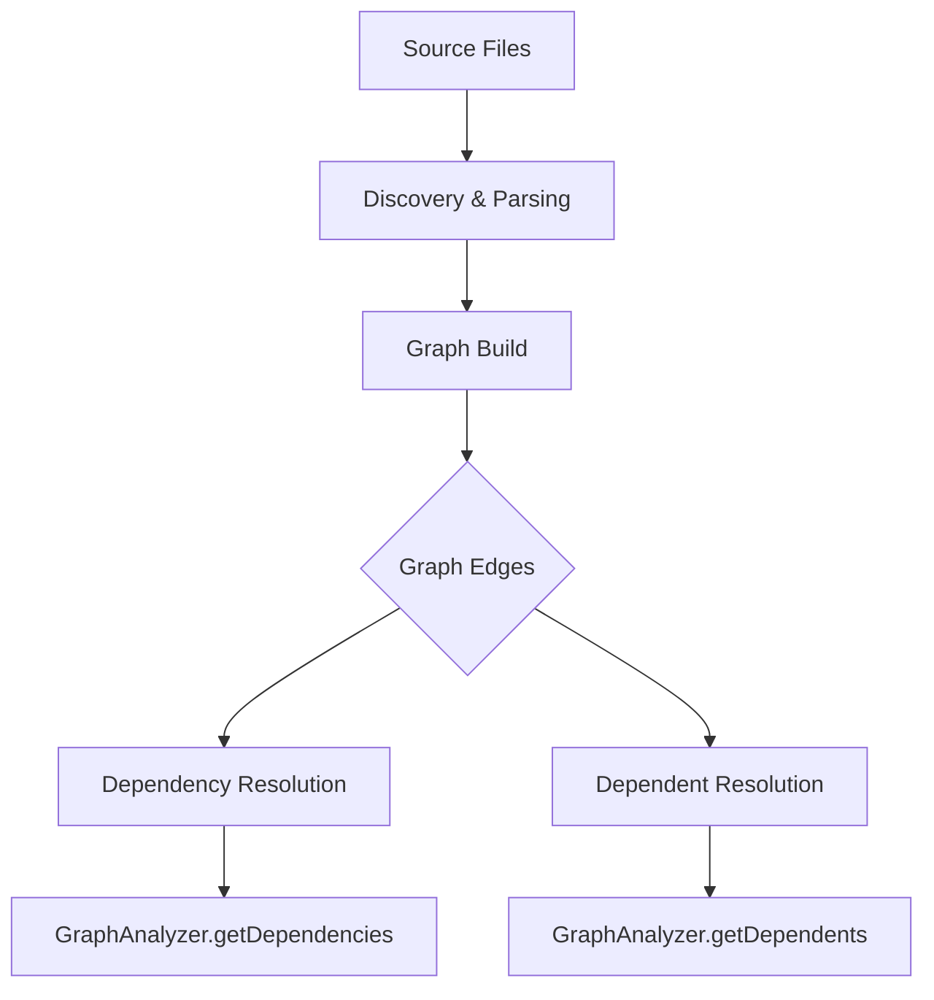

# Rust N-API Bindings Reference

This document describes the N-API surface exposed by the Rust analysis core (`crates/core`) and offers guidance for contributors working at the Rust/Node boundary. The bindings expose core functionality to Node.js/TypeScript via `napi-rs`.

## Module Overview

The surface is organized around the following modules:

- **AST**: TypeScript/JavaScript analysis.
- **Content**: Discovery and Markdown processing.
- **Graph**: Dependency graph analysis.
- **Crawler**: Project file discovery.
- **Context**: Project context resolution.
- **Utils**: Basic helpers.

---

## 1. Utils (`napi::utils`)

### Functions

#### `helloWorld(): string`

Returns a simple hello string to validate the N-API binding.

#### `getVersion(): string`

Returns the crate version from `Cargo.toml`.

---

## 2. AST (`napi::ast`)

### `AstAnalyzer` Class

#### `new(): AstAnalyzer`

Creates a new AST analyzer instance.

#### `analyzeFile(filePath: string): Promise<CodeSignature[]>`

Reads the given file and returns code signatures for exported symbols.

#### `analyzeCode(code: string): Promise<CodeSignature[]>`

Analyzes a string of TypeScript/JavaScript code.

#### `analyzeWithErrors(code: string): Promise<AnalysisResultJs>`

Returns a detailed analysis result including signatures and parsing errors.

### Data Types

```typescript
interface CodeSignature {
    symbolName: string;
    symbolType: string;
    signatureText: string;
    isExported: boolean;
    hash?: string;
}

interface AnalysisResultJs {
    signatures: CodeSignature[];
    errors: string[];
}
```

---

## 3. Content (`napi::content`)

### Functions

#### `discoverFiles(rootPath: string, options?: FileDiscoveryOptions): FileDiscoveryResult`

Scans a directory and returns markdown and source files found.

#### `extractAnchors(filePath: string, content: string): ExtractionResult`

Extracts Sintesi anchors from Markdown content.

#### `validateMarkdownAnchors(content: string): string[]`

Validates markdown anchors without extracting content. Returns error messages.

#### `parseCodeRef(codeRef: string): CodeRefParts`

Parses a code reference string (e.g., `"src/auth.ts#login"`).

### Data Types

```typescript
interface FileDiscoveryOptions {
    respect_gitignore?: boolean;
    include_hidden?: boolean;
    max_depth?: number;
}

interface FileDiscoveryResult {
    markdown_files: string[];
    source_files: string[];
    total_files: number;
    errors: number;
}

interface SintesiAnchor {
    id: string;
    code_ref?: string;
    file_path: string;
    start_line: number;
    end_line: number;
    content: string;
}

interface ExtractionResult {
    anchors: SintesiAnchor[];
    anchor_count: number;
    errors: string[];
}

interface CodeRefParts {
    file_path: string;
    symbol_name: string;
}
```

---

## 4. Graph (`napi::graph`)

### `GraphAnalyzer` Class

#### `new(rootPath: string): GraphAnalyzer`

Creates a graph analyzer bound to a root path.

#### `get_dependencies(filePath: string, allFiles: string[]): string[]`

Returns the list of files that the given file depends on (outgoing edges).

#### `get_dependents(filePath: string, allFiles: string[]): string[]`

Returns the list of files that depend on the given file (incoming edges).

---

## 5. Crawler (`napi::crawler`)

### Functions

#### `get_project_files(rootPath: string): NapiFileInfo[]`

Returns a list of files discovered under the root path.

### Data Types

```typescript
interface NapiFileInfo {
    path: string;
    extension?: string;
}
```

---

## 6. Context (`napi::context`)

### Functions

#### `get_project_context(rootPath: string): ProjectContext`

Returns a structured view of the project.

### Data Types

```typescript
interface ProjectContext {
    files: FileContext[];
    packageJson?: PackageJson;
}

interface FileContext {
    path: string;
    extension?: string;
    imports: string[];
    imported_by: string[];
}

interface PackageJson {
    name?: string;
    version?: string;
    dependencies?: Record<string, string>;
    devDependencies?: Record<string, string>;
    scripts?: Record<string, string>;
}
```

---

## Usage Examples (Node.js)

### AST Analysis

```javascript
const { AstAnalyzer } = require('@doctype/core');
const analyzer = new AstAnalyzer();

// Analyze file
const sigs = await analyzer.analyzeFile('src/index.ts');
console.log(sigs.map((s) => s.symbolName));

// Analyze code
const results = await analyzer.analyzeCode('export function foo() {}');
console.log(results[0].symbolName); // "foo"
```

### Content Discovery

```javascript
const { discoverFiles } = require('@doctype/core');

const res = discoverFiles('./src', {
    respect_gitignore: true,
    max_depth: 5,
});

console.log('Markdown files:', res.markdown_files.length);
console.log('Source files:', res.source_files.length);
```

### Graph Analysis

```javascript
const { GraphAnalyzer } = require('@doctype/core');
const ga = new GraphAnalyzer('/project/root');
const allFiles = ['src/a.ts', 'src/b.ts'];

const deps = ga.get_dependencies('src/a.ts', allFiles);
console.log('Dependencies:', deps);
```

---

## Flow Visualization



---

## Contribution Guidance

- **Stable API**: Export core functionality via `#[napi]` and keep API surface small.
- **Data Types**: Prefer plain data structures (`#[napi(object)]`) over opaque pointers.
- **Error Handling**: Propagate Rust errors as `napi::Error`.
- **Testing**: Add integration-style tests to exercise the N-API surface.

::: info Note
This reference reflects the N-API surface exposed by `crates/core`. For concrete examples, consult the Rust source bindings (`crates/core/src/napi`) and the associated TypeScript bindings (`index.d.ts`).
:::
